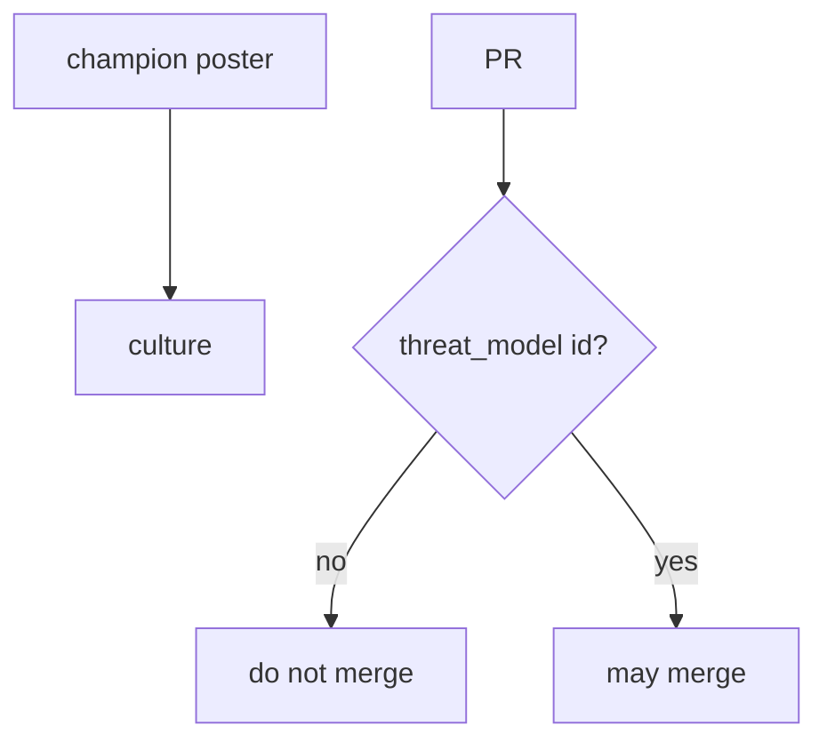
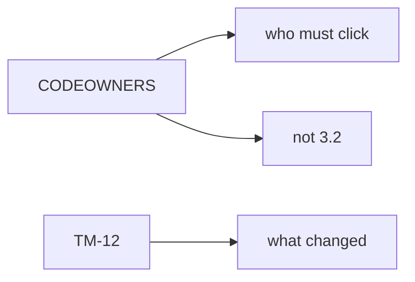

# 10.1-LO-01 — Culture is the merge gate, not a poster

**Kind:** concept-model
**Loop step:** 1 Property
**Standards:** NIST SSDF 1.1 (final) PW.1. OWASP SAMM 2.0 as measurement. CISA Secure by Design **unverified**. ASVS `v5.0.0-15.1.5` is **Level 3, advanced**. SSDF 1.2 IPD is **draft**.

## The claim this module owns

SecureCollab treats a material PR (identity, data, mobile, queues) as a 3.2 event. **Culture is whether that PR can merge without a threat-model identifier.** A champion poster, CODEOWNERS file, or “HIPAA training complete” is not that predicate.

> `merge_ok({})` must be false. `merge_ok({"threat_model": "TM-12"})` may be true.

The forbidden outcome is **merge without a threat-model identifier**. That is integrity of process evidence — surfaces without 3.2.

SSDF 1.1 PW.1 is design-review vocabulary, not `merge_ok`. SAMM measures whether the *practice exists*. CISA Secure by Design (unverified living page) talks manufacturer ownership — it does not stamp the PR. `v5.0.0-15.1.5` (document dangerous functionality) is **Level 3, advanced**: a reason to *require* a TM, not the gate itself.

## Mental model: poster vs gate



## Mental model: CODEOWNERS is not a TM



**Mechanism (not the property):** CODEOWNERS, SAMM score, training checkbox, Secure by Design pledge.

## Root cause vs impact vs prevention vs detection vs recovery

| Slice | For this property |
|---|---|
| Root cause | Security as a later phase |
| Preconditions | `merge_ok({})` true |
| Trigger | Identity/data/mobile PR without TM |
| Impact | Surfaces without 3.2 |
| Prevention | Require tm id; triggers on those surfaces |
| Detection | `merge_blocked_no_tm` |
| Recovery | Open TM, then merge |

## Framework defaults versus the merge guarantee

GitHub required reviewers are not a threat model. A stale tm-id is a 3.2 age problem — still better than none, still not a rubber stamp forever.

## Mechanism limits

- Hotfix path must still *record* a TM after the fact.
- Vanity vuln-count KPIs.
- Exceptions without expiry (E6).

## Usability and accessibility

Merge and checklist UIs must be usable by the actual reviewers you have (WCAG 2.2 4.1.3: say which surface needs a TM).

## Practice

Write the merge checklist line. Then run:

```
python3 -m pytest labs/10.1/10.1-lab/tests --impl vulnerable
python3 -m pytest labs/10.1/10.1-lab/tests --impl fixed
```

The first command must fail. The second must pass.

## Transfer

Exception path (E6). Clinic: “HIPAA training complete” as merge.

## Non-goals

Live GitHub orgs, claiming Gate 10 or M4. Answer keys are not in this file.
