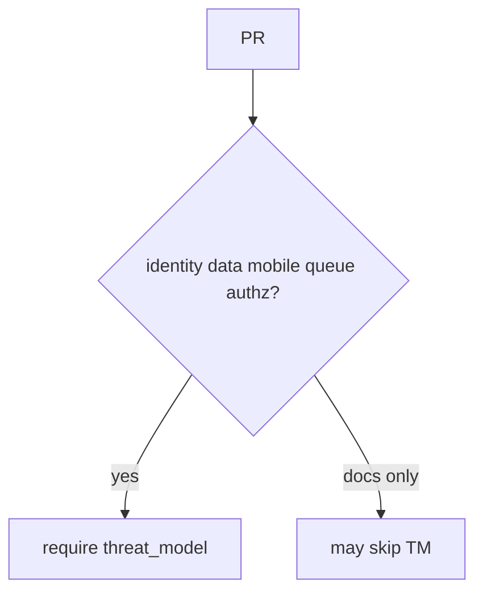
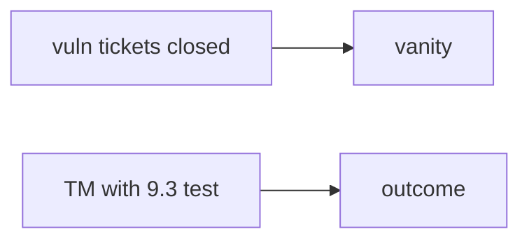

# Change-trigger table vs CODEOWNERS

**Kind:** design-exercise
**Loop step:** 2 Model

## Could someone else name which changes need a threat model?

“We have CODEOWNERS” is not this lesson. A drawing someone else can test names **the surfaces that trigger a threat model: identity, stored data, mobile, queues, and authorization**.

This week’s freeze for the notes app: local `merge_ok(pr)`. No live orgs.

> For an empty change, merge is deny. A change that names `threat_model` as `TM-12` may merge. Evidence that the deny is false: `merge_ok({})` returns true.

If the trigger table is blank, CODEOWNERS looks finished because nobody named which files need a model.

## Picture: which surfaces trigger a threat model

## Picture: vanity count vs outcome

CODEOWNERS says who must click. It does not say what changed. A closed-ticket count is a vanity score. A threat model that points at a real test (9.3) is an outcome.

## Step 1: name the pieces

Take the merge check you already have and ask which surfaces would make an empty dict merge.

| Piece | This system |
|---|---|
| Who | Schedule pressure |
| What | The pull request; the threat-model id |
| Actions | `merge_ok` |
| Paths | GitHub merge |
| What you trust for this journey | The merge check |
| What you do not trust | A poster; CODEOWNERS; a training checkbox |
| Time | Threat-model age (3.2); hotfix recorded after the fact |
| The rule | Honesty of the process evidence you show before merge |

## Step 2: write allow and deny

| Who | What | Action | Decision |
|---|---|---|---|
| Empty change metadata | merge | allow | deny |
| threat_model TM-12 | merge | allow | may allow |
| CODEOWNERS only | merge | treat as a threat model | deny |
| HIPAA training | merge | treat as a threat model | deny |

A missing threat-model cell is how a required-reviewer list becomes false assurance. Write the hole.

## Practice

Look in `labs/10.1/10.1-lab`, starting with `sdl.py`.

## Use it somewhere new

An exception path (E6): the exception still names the missing threat model and when it expires.

## What can still go wrong

A stale threat-model id. Vanity ticket counts. An extra advanced row about documenting a dangerous function that you never actually wrote down.

## What this page is not doing

Answer keys are not on this site.
