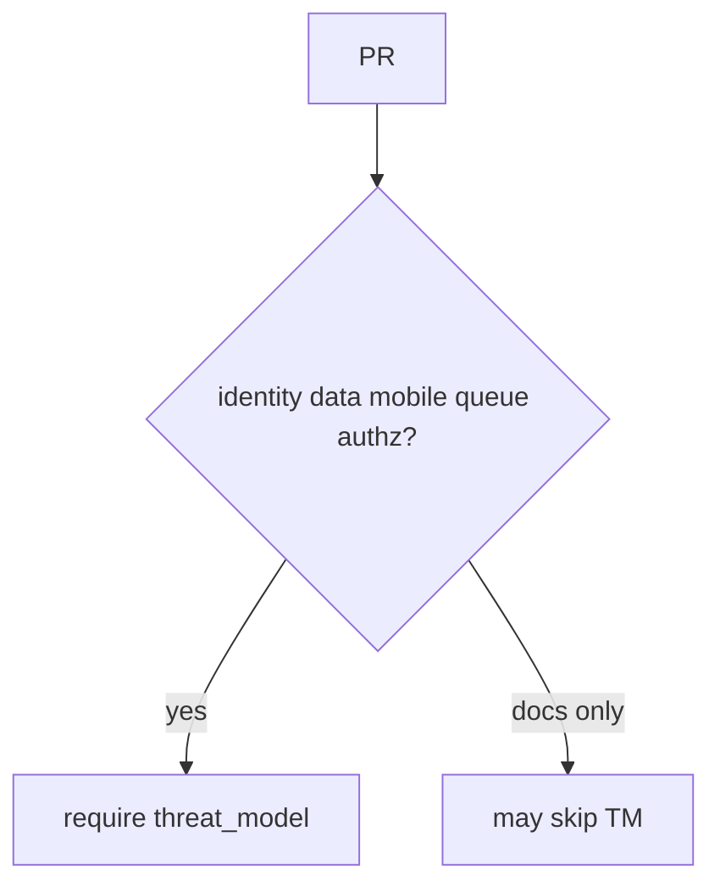
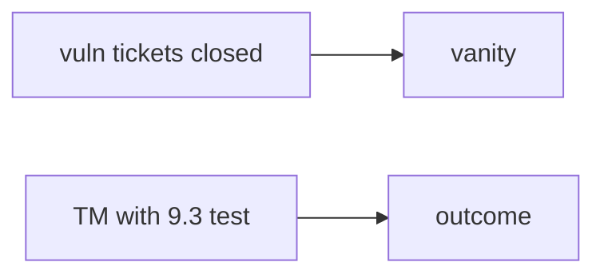

# 10.1-LO-02 — Change-trigger matrix vs CODEOWNERS

**Kind:** design-exercise
**Loop step:** 2 Model
**Standards:** NIST SSDF 1.1 PW.1. Module 3.2 threat modeling.

## Can a second engineer name which PRs need a TM?

“We have CODEOWNERS” is not this lesson. A reviewable model names **surfaces that trigger a TM: identity, data, mobile, queues, authz**.

SecureCollab freeze: local `merge_ok(pr)`. No live orgs.

## Mental model: triggers

## Mental model: vanity vs outcome

## Step 1: freeze pieces

| Piece | This system |
|---|---|
| Subjects | schedule pressure |
| Objects | PR; TM id |
| Actions | `merge_ok` |
| Channels | GitHub merge |
| TCB | merge predicate |
| Untrusted | poster; CODEOWNERS; training checkbox |
| State / time | TM age (3.2); hotfix after-the-fact |
| 1.1 cell | integrity of process evidence |

## Step 2: write cells

| Subject | Object | Action | Decision |
|---|---|---|---|
| empty PR meta | merge | allow | deny |
| threat_model TM-12 | merge | allow | may allow |
| CODEOWNERS only | merge | treat as TM | deny |
| HIPAA training | merge | treat as TM | deny |

## Practice

Draw the trigger matrix. Point at `labs/10.1/10.1-lab` file `sdl.py`.

## Transfer

E6: an exception still names the missing TM and expiry.

## Residual risk

Stale tm-id; vanity KPIs; `v5.0.0-15.1.5` Level 3 undocumented dangerous functionality.

## Non-goals

Top 10 as the definition of security. Keys stay out of lessons.
