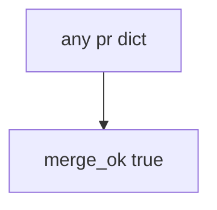

# Practice: always-true merge_ok

**Kind:** mechanism-lab
**Loop step:** 3 Break

## Try it

The practice is not a website you attack. It is a tiny Python `merge_ok(pr)` that returns true or false. The failure is already in the function: every dict is allowed to merge. You are here to see that the check treats that as a **failed rule**, not as a missing GitHub setting.

The rule under test:

> An empty change must not merge. If `merge_ok({})` is true, the process evidence you show before merge has failed as a security control.

## Where you may practice

Only `labs/10.1/10.1-lab` is in scope. The practice is an in-process `merge_ok(pr)`. The change is a synthetic dict. No live GitHub orgs, no employer repos, no clinic systems. Do not send the dict anywhere.

Do not turn off branch protection on a real org “to see what happens.” Do not paste this exercise onto a public GitHub org, employer repo, or live clinic.

What is supposed to stop this: `merge_ok` is supposed to require a **truthy threat-model id**. Branch protection, CODEOWNERS, training checkboxes, and FastAPI defaults are not enough.

Who can merge in this story: schedule pressure plus an always-true merge check. That stands in for “CODEOWNERS plus annual HIPAA training so we merge identity changes,” a maturity score on a slide, or a champion poster treated as 3.2.

## Picture: every change merges



The broken files take that path on purpose. You do not need GitHub. You must not merge in a live org. The true return *is* the leak of honesty.

The threat-modeling lessons (3.2) already said how to write the model. This check is **whether a citation exists before merge**. A poster is a belief. It does not put `threat_model` on the change.

## What to look at — cause, not a dump

Read `vulnerable/sdl.py`. It returns true for every dict. Tests:

- `test_merge_requires_threat_model_id`
- `test_pr_with_threat_model_may_merge` — `{"threat_model": "TM-12"}` may pass on both

You do not need a new pull-request key. The failure of `test_merge_requires_threat_model_id` *is* the evidence.

Do not open the repaired files yet. Diagnose the cause first.

| What you see | What kind of failure | Not the lesson |
|---|---|---|
| `merge_ok` true for every dict | No threat-model id required | “We have CODEOWNERS” |
| Empty dict merges | Always-true merge used as the payload | A green required-reviewer tile |
| No `threat_model` field required | The sink accepted any dict | “We finished HIPAA training” |

## Why it happens vs what it costs

| Slice | Practice |
|---|---|
| The rule | `merge_ok({})` is false |
| Why it happens | No threat-model id required; merge always true |
| What has to be true first | `merge_ok` is true for every dict |
| Trigger | An identity change merges with no 3.2 citation |
| What it costs | Surfaces land without a threat model |
| How you stop it later | Require a truthy `threat_model`; empty or None is deny |
| How you notice later | `merge_blocked_no_tm`; never GitHub tokens |
| How you recover later | Add a threat-model id; re-run `merge_ok` |
| Out of scope | A maturity score, a live GitHub org, or claiming Gate 10 |

Required reviewers on GitHub are off until someone turns them on, and an admin can still bypass them. CODEOWNERS says who clicks, not what changed. FastAPI has no software-lifecycle check. The app’s promise this week is: **this** practice, an empty change is deny.

A design-review guide is vocabulary, not this check. Gate 10 and M4 stay **not finished**.

## Practice

From the repository root, in a throwaway environment:

```text
python3 -m pytest labs/10.1/10.1-lab/tests --impl vulnerable
```

Run from `labs/10.1/10.1-lab` if a collection at the repo root picks up `site/`. Record `test_merge_requires_threat_model_id`. Do not probe public hosts. A setup error is not proof the rule holds.

## Use it somewhere new

A clinic example: predict “HIPAA training complete” used as merge — still only this directory. Do not change a live GitHub org.

## What this page is not doing

No live-org or weaponized instructions. Fake pull-request dicts only. Do not dump real people’s data into the practice files. Do not “fix” the practice by deleting the test. Do not claim Gate 10 or M4. An unverified “secure by design” page stays unverified. A later draft of the design-review guide stays a draft.
