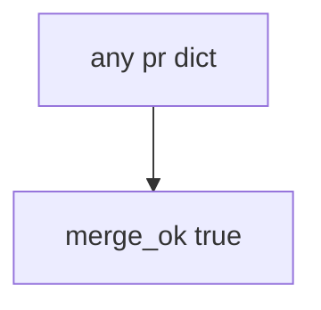

# 10.1-LO-03 — Observe always-true merge_ok

**Kind:** mechanism-lab
**Loop step:** 3 Break
**Standards:** NIST SSDF 1.1 (final) PW.1 as design-review vocabulary. OWASP SAMM 2.0 as measurement vocabulary. CISA Secure by Design **unverified**. ASVS `v5.0.0-15.1.5` is **Level 3, advanced**. SSDF 1.2 IPD is **draft**. Lab policy: local only.

## Authorized scope

`labs/10.1/10.1-lab` only. The fixture is an in-process `merge_ok(pr)`. Synthetic PR dict. No live GitHub orgs.

**Forbidden outcome:** Merge without a threat-model identifier. `merge_ok({})` returns true.

Attacker capability in this lab: schedule pressure plus an always-true merge gate. That stands in for “CODEOWNERS plus annual HIPAA training so we merge identity PRs,” a SAMM score on a slide, or a champion poster treated as 3.2. Trust assumption: `merge_ok` is supposed to require a **truthy threat-model id**. GitHub branch protection, CODEOWNERS, training checkboxes, and FastAPI defaults are not in the TCB for this cell.

## Mental model: every PR merges



The vulnerable tree demonstrates **cause** (security as a later phase). Do not change production branch protection on a real org as the exercise. Preconditions: `merge_ok` returns true for every dict. You do not need GitHub. You must not merge in a live org.

SSDF 1.1 PW.1 is design-with-security vocabulary, not this predicate. Module 3.2 already said how to write the model; this cell is **citation exists before merge**. Gate 10 and M4 stay **not-attempted**.

## What to read in the fixture

`vulnerable/sdl.py` returns true for every dict. Tests:

- `test_merge_requires_threat_model_id`
- `test_pr_with_threat_model_may_merge` — `{"threat_model": "TM-12"}` may pass on both

You do not need a new PR key. The failure of `test_merge_requires_threat_model_id` *is* the evidence.

Do not open the fixed tree yet. Diagnose the cause first.

## Root cause vs impact vs prevention vs detection vs recovery

| Slice | This lab |
|---|---|
| Required property | `merge_ok({})` is false |
| Root cause | No TM required; merge always true |
| Preconditions | `merge_ok` true for every dict |
| Trigger | Identity PR merges without a 3.2 citation |
| Impact | Surfaces without a threat model |
| Prevention | Require truthy `threat_model`; empty/None deny |
| Detection | `merge_blocked_no_tm`; never GitHub tokens |
| Recovery | Add a TM id; re-run merge_ok |
| Not the lesson | A SAMM score; live GitHub org; Gate 10 complete |

## Framework defaults versus the merge guarantee

GitHub required checks are off until configured and can be bypassed by admins. CODEOWNERS says who clicks, not what changed. FastAPI has no SDL. The application guarantee is: **this** fixture, empty PR is deny.

## Practice

```text
python3 -m pytest labs/10.1/10.1-lab/tests --impl vulnerable
```

Run from `labs/10.1/10.1-lab` if a repo-root collection picks up `site/`. Record `test_merge_requires_threat_model_id`. Do not probe public hosts. An environment error is not security evidence.

## Transfer

Clinic HIPAA training as merge: predict without leaving this directory. Do not change a live GitHub org.

## Non-goals

No live-org or weaponized instructions. Do not claim Gate 10 or M4. CISA Secure by Design stays labeled unverified. SSDF 1.2 IPD stays labeled draft.
