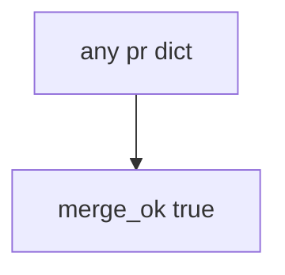

# 10.1-LO-03 — Observe always-true merge_ok

**Kind:** mechanism-lab
**Loop step:** 3 Break
**Standards:** NIST SSDF 1.1 PW.1.

## Authorized scope

`labs/10.1/10.1-lab` only. Synthetic PR dict. No live GitHub orgs.

**Forbidden outcome:** Merge without a threat-model identifier.

## Mental model: every PR merges



The vulnerable tree demonstrates **cause** (security as a later phase). Do not change production branch protection on a real org as the exercise.

## What to read in the fixture

`vulnerable/sdl.py` returns true for every dict. Tests require `merge_ok({})` to be false.

## Root cause vs impact

| Slice | Lab |
|---|---|
| Root cause | No TM required |
| Impact | Surfaces without 3.2 |
| Not the lesson | A SAMM score as the definition |

## Practice

```
python3 -m pytest labs/10.1/10.1-lab/tests --impl vulnerable
```

Record `test_merge_requires_threat_model_id`. Do not probe public hosts.

## Transfer

Clinic HIPAA training as merge: predict without leaving this directory.

## Non-goals

No live-org or weaponized instructions.
