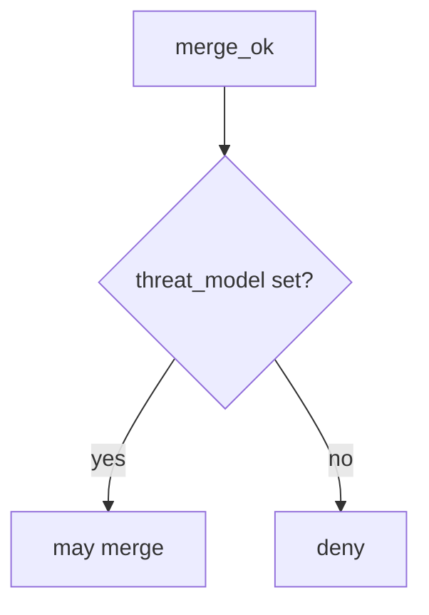

# 10.1-LO-04 — Require a threat_model identifier

**Kind:** design-exercise
**Loop step:** 4 Build
**Standards:** NIST SSDF 1.1 PW.1.

## Structural means merge looks for the id

`merge_ok` must require a truthy `threat_model` field. Empty dict denies. The lab does not check TM *quality* — name that residual (3.2 age).

## Mental model: fail closed



Do not accept CODEOWNERS as the field.

## Why this restores the cell

| After the fix | Must be true |
|---|---|
| `{}` | merge false |
| `{threat_model: TM-12}` | merge true |

## What this is not

A 3.2 quality review. SAMM. Secure by Design. Gate 10 / M4.

## Practice

Name the residual (stale id). Run:

```
python3 -m pytest labs/10.1/10.1-lab/tests --impl fixed
```

Must pass.

## Transfer

Clinic: stop treating training completion as `threat_model`.

## Residual risk

Rubber-stamp ids; hotfix without after-the-fact TM; E6.
