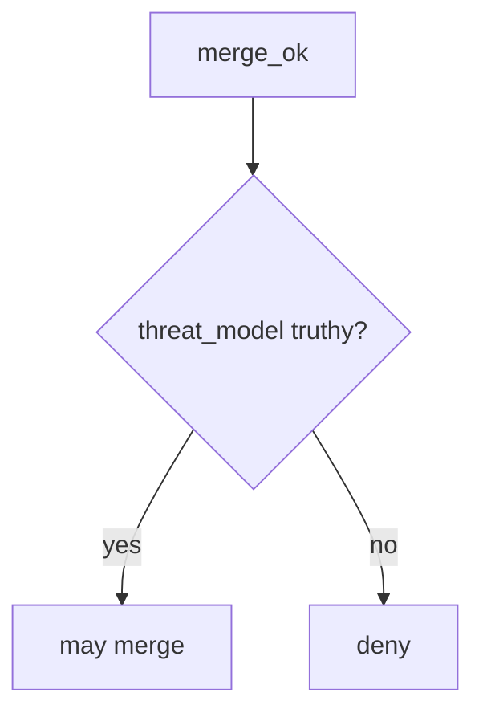

# Require a threat-model identifier

**Kind:** design-exercise
**Loop step:** 4 Build

## The rule

The old pull-request titles are not a threat-model id. Hiding a scan result does not fill `merge_ok`. A CODEOWNERS file does not finish this.

What has to change: `merge_ok` **is false unless the change has a truthy `threat_model`**. A missing id is deny. In short, that citation — not CODEOWNERS, not HIPAA training, not a maturity score.

Repair the notes app’s merge culture: `{}` → do not merge. Don't allow it just because branch protection is “on.” Do not accept “training complete” as a threat-model id. The id is **opaque** — `"TM-12"` is enough for this lab. Whether the document actually covers this change is 3.2 and 10.4.

## Picture: empty threat-model fails closed



Merge has to see `bool(pr.get("threat_model"))`. Citing `TM-12` that never mentions OAuth is still a lying citation. Authorization surfaces remain 3.2. An extra advanced row about documenting a dangerous function is a reason to *require* a threat model. It does not put `threat_model` on the change.

A design-review guide that wants security in the design covers empty-change merge. The check is the local stand-in.

## What the repaired files must show

Do not treat `fixed/sdl.py` as a production merge bot.

| After the fix | Must be true |
|---|---|
| `{}` | `merge_ok` false |
| `{"threat_model": "TM-12"}` | `merge_ok` true |

When you are unsure whether a threat-model id is present, the change does not merge. CODEOWNERS being on does not change that.

## What this is not

- GitHub branch protection.
- CODEOWNERS.
- A process-maturity score.
- An unverified “secure by design” page treated as a product.
- Gate 10 or M4 complete.
- A threat-model quality review.
- FastAPI defaults.

## What the tool cannot do

- An opaque id: `"TM-12"` is not proof the model covers this change.
- Python `bool()` truthiness: an empty string is false; `"0"` is true — write down the convention.
- No file-path check: a README-only change and an authorization change look the same if both cite TM-12.
- No actor check: anyone can type TM-12.
- A docs exemption must be an explicit check, not a deleted gate.

## Can people still use it

The merge screen has to say *missing threat-model id*, in words, not only a red X. CODEOWNERS being on is not the missing-id sentence.

## Practice

Name the leftover (a stale threat model; a docs exemption). Run:

```text
python3 -m pytest labs/10.1/10.1-lab/tests --impl fixed
```

## Use it somewhere new

A “docs: update README” change with no threat-model id still fails `merge_ok` in this lab. If you exempt it, write the exemption in the check.

## What can still go wrong

Stale TM-12. Vanity ticket counts. Exceptions without expiry (E6). An extra advanced row about documenting a dangerous function that you still never wrote down.
