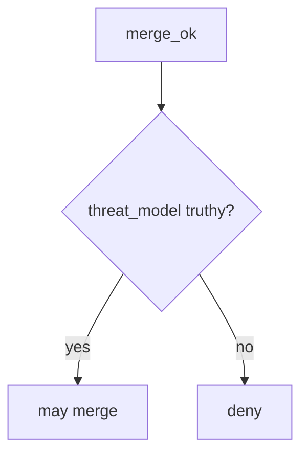

# 10.1-LO-04 — Require a threat-model identifier

**Kind:** design-exercise
**Loop step:** 4 Build
**Standards:** NIST SSDF 1.1 (final) PW.1. OWASP SAMM 2.0 as vocabulary. CISA Secure by Design **unverified**. ASVS `v5.0.0-15.1.5` is **Level 3, advanced**. SSDF 1.2 IPD is **draft**.

## Structural means merge looks at the TM id

`merge_ok` must be false unless `pr` has a truthy `threat_model`. Fail-safe: missing id is deny. Structural means that citation — not CODEOWNERS, not HIPAA training, not a SAMM score.

The smallest restore for SecureCollab’s merge culture is: `{}` → do not merge. Do not fail open because branch protection is “on.” Do not accept “training complete” as a threat-model id. The id is **opaque** — `"TM-12"` is enough for this lab. Completeness of the document is 3.2 / 10.4.

## Mental model: empty threat-model fails closed



The lab’s fixed tree requires `bool(pr.get("threat_model"))`. Production still needs the cited model to *cover this PR’s files* — citing `TM-12` that never mentions OAuth is a lying citation. Authz surfaces remain 3.2. `v5.0.0-15.1.5` (document dangerous functionality) is Level 3 advanced: a reason to *require* a TM, not this pytest.

SSDF 1.1 PW.1 wants design with security. This pytest is that sentence for empty-PR merge.

## Why this restores the cell

| After the fix | Must be true |
|---|---|
| `{}` | `merge_ok` false |
| `{"threat_model": "TM-12"}` | `merge_ok` true |

## What this is not

GitHub branch protection. CODEOWNERS. SAMM. CISA Secure by Design as verified. Gate 10 / M4. A threat-model quality review. FastAPI defaults.

## Mechanism limits

- Opaque id: `"TM-12"` is not proof the model covers this PR.
- `bool()` truthiness: empty string is false; `"0"` is true — document the convention.
- No file-path check: README-only and authz PRs look the same if both cite TM-12.
- No actor check: anyone can type TM-12.
- Docs exemptions must be an explicit predicate, not a deleted gate.

## Practice

Name the residual (stale TM; docs exemption). Run:

```text
python3 -m pytest labs/10.1/10.1-lab/tests --impl fixed
```

Must pass. Run from the lab directory if collection at repo root is polluted.

## Transfer

A “docs: update README” PR with no TM id still fails `merge_ok` in this lab. If you exempt, write the exemption in the predicate.

## Residual risk

Stale TM-12; vanity KPIs; E6 exceptions; Level 3 `v5.0.0-15.1.5` evidence still missing.

## Non-goals

Do not wire this into a live GitHub org. Do not claim Gate 10. Do not present CISA Secure by Design as verified or SSDF 1.2 IPD as final.
