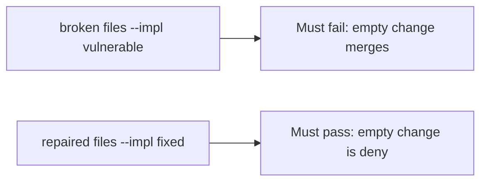

# A broken merge check must fail the empty-change test

**Kind:** verification-lab
**Loop step:** 5 Verify

## Check it

A CODEOWNERS file does not require a threat-model id. Maturity Level 3 is a score. `merge_ok({})` has to be false, and `{"threat_model": "TM-12"}` may merge. On the broken files the empty change still returns true. On the repaired files it does not. Do not merge in a live GitHub org.

## Picture: a broken merge check must fail the empty-change test

A passing-test tally can still hide that an empty dict still merges.



If both pass, you are not looking at `threat_model`.

## What the check has to show

| Mode | Must show for this topic |
|---|---|
| Normal | `{"threat_model": "TM-12"}` → may merge (may pass on both) |
| Wrong input | `{}` → not merge; empty threat-model change must fail merge |
| Abuse | Unsure or empty ids are deny (fail closed; leftover if not in this check) |
| Not claimed | A live GitHub org; Gate 10; a maturity score; that TM-12 covers this change |

The test `test_merge_requires_threat_model_id` is there so always-true `merge_ok` still fails.

A change that already cites `TM-12` may pass on both sides. You still have to deny a change with no threat-model id. If the broken files do not fail `test_merge_requires_threat_model_id`, the lab is miswired — fix the wiring, not the assertion.

```text
python3 -m pytest labs/10.1/10.1-lab/tests --impl vulnerable
python3 -m pytest labs/10.1/10.1-lab/tests --impl fixed
```

A `CODEOWNERS` file in the repo is not `merge_ok({})`. This practice never opens a live GitHub org.

## What the checks do not prove

- That TM-12’s listed files include this change’s paths (3.2 owns quality)
- That the author may cite that id
- An unverified “secure by design” page as a product
- Extra advanced software-lifecycle evidence about documenting dangerous functions
- Gate 10 or M4 complete

## Practice

Do not treat a grep for `CODEOWNERS` in a repo as the check. Call `merge_ok({})`.

## Use it somewhere new

Asserting “HIPAA training complete” is not this check. Do not use a live GitHub org.

## What this page is not doing

Do not treat a live org screenshot as proof. Do not log GitHub tokens. Answer keys are not on this site. This page does not finish check-in 10.
