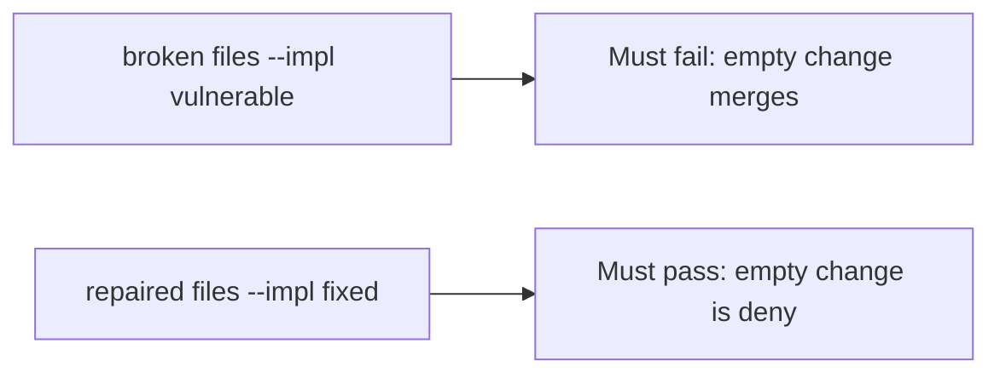

# A broken merge check must fail the empty-change test

**Kind:** verification-lab
**Loop step:** 5 Verify

## If you cannot test it, it is still a slogan

“CODEOWNERS is on” is not evidence. “Maturity Level 3” is a tool observation. The check is: `merge_ok({})` is false and `{"threat_model": "TM-12"}` may merge. That empty-change observation must be **false** on the broken files (they return true) and **true** on the repaired files. Do not merge in a live GitHub org.

## Picture: a broken merge check must fail the empty-change test

A test that only counts passing checks can pass while an empty dict still merges. Ask whether merge without a threat-model id still counts as a pass. The broken files must fail that. The repaired files must pass it.



If both pass, the test is not looking at `threat_model`. If both fail, the fix is not structural or the check is wrong.

## Four modes, even for a merge dict

| Mode | Must show for this topic |
|---|---|
| Normal | `{"threat_model": "TM-12"}` → may merge (may pass on both) |
| Wrong input | `{}` → not merge; empty threat-model change must fail merge |
| Abuse | Unsure or empty ids are deny (fail closed; leftover if not in this check) |
| Not claimed | A live GitHub org; Gate 10; a maturity score; that TM-12 covers this change |

The file is `labs/10.1/10.1-lab/tests/test_property.py`. The test `test_merge_requires_threat_model_id` is a **what must not happen** test: always-true `merge_ok` is not allowed to count as a pass.

Honest `{"threat_model": "TM-12"}` may pass on both implementations. That does not excuse the empty-change deny test. If the broken files do not fail `test_merge_requires_threat_model_id`, the lab is miswired — fix the wiring, not the assertion.

```text
python3 -m pytest labs/10.1/10.1-lab/tests --impl vulnerable
python3 -m pytest labs/10.1/10.1-lab/tests --impl fixed
```

A test that only greps `CODEOWNERS` in a repo without calling `merge_ok({})` is not this topic’s evidence. This practice never opens a live GitHub org.

## What the checks do not prove

- That TM-12’s listed files include this change’s paths (3.2 owns quality)
- That the author may cite that id
- An unverified “secure by design” page as a product
- Extra advanced software-lifecycle evidence about documenting dangerous functions
- Gate 10 or M4 complete

Record those as leftover or later topics, not as silent passes.

## Practice

Run both this session from the lab directory if needed:

```text
python3 -m pytest labs/10.1/10.1-lab/tests --impl vulnerable
python3 -m pytest labs/10.1/10.1-lab/tests --impl fixed
```

Paste nothing from answer keys. Write fail/pass into your notes next to the trigger-table row. Reject a “test” that only greps `CODEOWNERS` in a repo without calling `merge_ok({})`.

## Use it somewhere new

A clinic example: a test that only asserts “HIPAA training complete” is not this topic. A live GitHub org is out of scope.

## What this page is not doing

Do not treat a live org screenshot as proof. Do not log GitHub tokens. Answer keys are not on this site. Gate 10 stays not finished.
