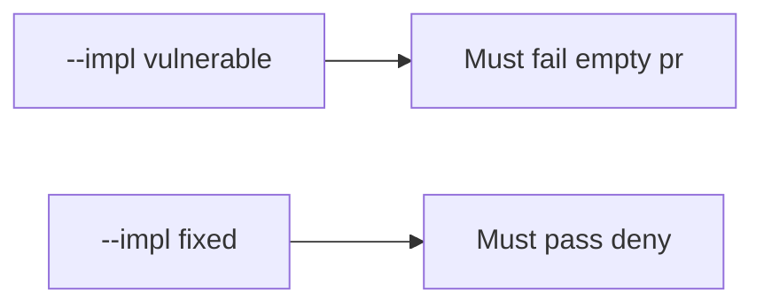

# 10.1-LO-05 — Evidence is empty PR denied, then a passing pair

**Kind:** verification-lab
**Loop step:** 5 Verify
**Standards:** NIST SSDF 1.1 PW.1.

## An invariant that cannot fail a test is still a slogan

“We have champions” is not evidence. The oracle is the local pair.

## Mental model: empty threat-model PR must fail merge

The failing observation on `--impl vulnerable` is an empty PR with no `threat_model` field. A passing collection count is not this cell.



| Case | Must show |
|---|---|
| Negative / abuse | `{}` → cannot merge |
| Normal | `threat_model` set → may merge |
| Not claimed | live GitHub; Gate 10; SAMM |

```
python3 -m pytest labs/10.1/10.1-lab/tests --impl vulnerable
python3 -m pytest labs/10.1/10.1-lab/tests --impl fixed
```

Honest TM id may pass on both.

## What the tests do not prove

- TM quality (3.2)
- That a 9.3 test exists for the surface
- M4

## Practice

Execute both implementations. Map each test to an LO-02 cell.

## Transfer

Clinic: a test that only asserts “training complete” is not this cell.
