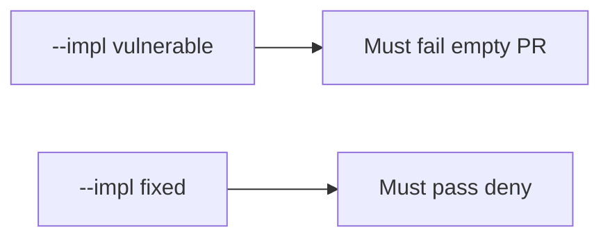

# 10.1-LO-05 — Evidence is empty-PR denied, then a passing pair

**Kind:** verification-lab
**Loop step:** 5 Verify
**Standards:** NIST SSDF 1.1 (final) PW.1. ASVS `v5.0.0-15.1.5` Level 3 **advanced**. CISA Secure by Design **unverified**.

## An invariant that cannot fail a test is still a slogan

“CODEOWNERS is on” is not evidence. “SAMM Level 3” is a mechanism observation. The oracle is: `merge_ok({})` is false and `{"threat_model": "TM-12"}` may merge. The empty-PR observation must be **false** on `--impl vulnerable` (returns true) and **true** on `--impl fixed`. Do not merge in a live GitHub org.

## Mental model: empty threat-model PR must fail merge

The failing observation on `--impl vulnerable` is **empty PR**. A passing collection count is not this cell.



| Mode | Must show for this module |
|---|---|
| Negative / abuse | `{}` → not merge; empty threat-model PR must fail merge |
| Normal | `{"threat_model": "TM-12"}` → may merge (may pass on both) |
| Not claimed | live GitHub; Gate 10; SAMM; that TM-12 covers this PR |

Lab tests in `labs/10.1/10.1-lab/tests/test_property.py`. `test_merge_requires_threat_model_id` is a **forbidden-outcome** test: always-true `merge_ok` is not allowed to count as a passing control.

```text
python3 -m pytest labs/10.1/10.1-lab/tests --impl vulnerable
python3 -m pytest labs/10.1/10.1-lab/tests --impl fixed
```

Honest `{"threat_model": "TM-12"}` may pass on both implementations. That does not excuse the empty-PR deny test. If vulnerable does not fail `test_merge_requires_threat_model_id`, the lab is miswired—fix the wiring, not the assertion.

## What the tests do not prove

- That TM-12’s listed files include this PR’s paths (3.2 quality)
- That the author may cite that id
- CISA Secure by Design as a verified pin
- Level 3 SDL evidence (`v5.0.0-15.1.5`)
- Gate 10 / M4 complete

Record those as residuals or later modules, not as silent passes.

## Practice

Execute both implementations this session from the lab directory if needed. Write the fail/pass pair next to the matrix row. Reject a “test” that only greps `CODEOWNERS` in a repo without calling `merge_ok({})`.

## Transfer

Clinic: a test that only asserts “HIPAA training complete” is not this cell. A live GitHub org is out of scope.

## Non-goals

Do not add a live-org trophy. Do not log GitHub tokens. Keys stay out of this file. Gate 10 stays not-attempted.
