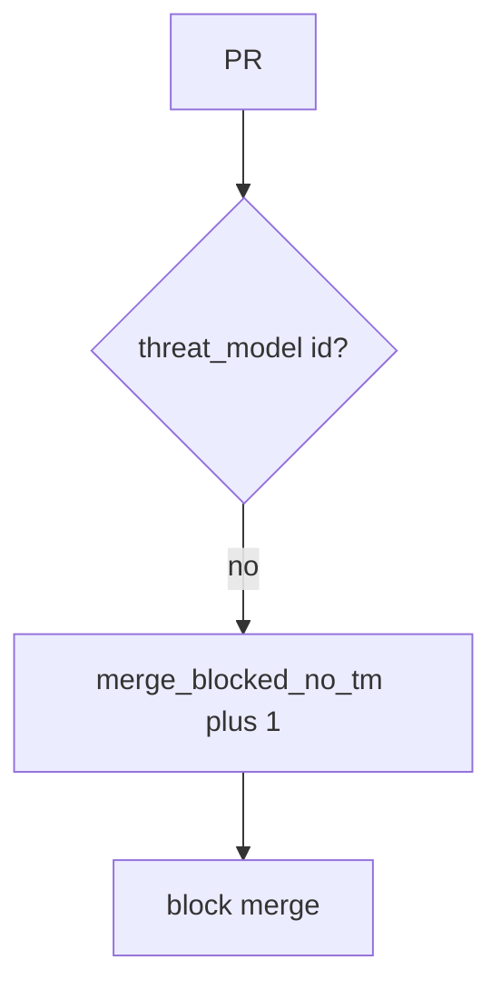

# Block the merge without logging the threat-model body

**Kind:** operations-exercise
**Loop step:** 6 Operate

## Fixing it once is not enough

A new identity change can merge with no threat-model id. GitHub tokens, real org names, and private threat-model bodies stay out of chat.

## Picture: missing threat-model id is a signal

If merge is blocked, page the change id — not the threat-model body. Then add the missing threat-model id.



A GitHub CODEOWNERS file does not put `threat_model` on the change.

No threat-model id still has to block merge in `test_merge_requires_threat_model_id`. Requiring CODEOWNERS does not put a threat-model id on the change. A stale TM-12 that never mentions OAuth is leftover from topic 3.2 — do not call the merge safe until that row exists.

## Signals that do not become a second leak

| Outcome | This topic |
|---|---|
| Notice | `merge_blocked_no_tm` |
| What the line holds | Change id, synthetic author id, threat-model present or absent; **never** tokens or bodies |
| Respond | Stop the merge that would land the hole; do not paste threat-model bodies into chat |
| Recover | Add a threat-model id; re-run `merge_ok` |
| Leftover | Stale threat models; docs exemptions; vanity ticket counts |

GitHub’s audit log is not this lab’s trusted core. A maturity dashboard will show process scores and stay silent when CI’s `merge_ok` is always true. Detection must observe **empty change is deny**, not poster counts. If the alert includes a GitHub token, you have opened a secrets hole (5.3). If the alert includes the threat-model body, you have copied the model into the pager.

```text
log_denied reason=merge_blocked_no_tm pr=123
```

That sample reprints the org if it still has a token, a real org name, a threat-model body, or “Gate 10 complete.”

## What the framework does vs what you still have to check

Always-true merge, a stale TM-12, and docs exemptions still land without a threat-model id even if CODEOWNERS is green.

Merge without a threat-model id is why it broke. The damage is an identity surface that 3.2 never modelled. Put the truthy `threat_model` check in the path. Watch `merge_blocked_no_tm`. Recover by adding a threat-model id and re-running `merge_ok`. It does not prove TM-12 covers this change’s files, and it does not replace 3.2 authorship or 10.4 governance evidence.

## Can people still use it

A refused merge must say *why* (missing threat-model id), in words, not only “assert False.” If operators see a blocked-merge badge, do not encode it as color only.

## Practice

```text
log_denied reason=merge_blocked_no_tm pr=123
```

A token, a real org name, a threat-model body, or “Gate 10 complete” should stay off this threat-model line.

## Use it somewhere new

Block an identity change with no threat-model id; do not paste HIPAA training certificates into the ticket. Do not change a live org.

## What this page is not doing

Do not run live-org traces. This page does not finish check-in 10 or milestone M4. An unverified “secure by design” page stays unverified. A later draft of the design-review guide stays a draft. Answer keys are not on this site.
