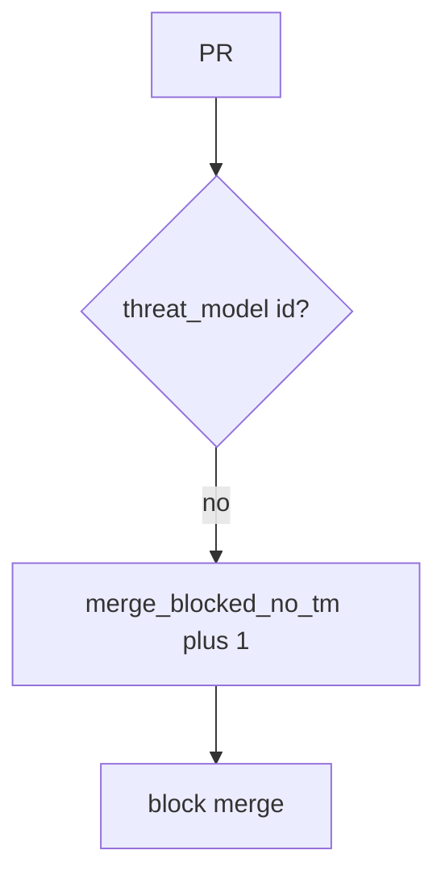

# Block the merge without logging the threat-model body

**Kind:** operations-exercise
**Loop step:** 6 Operate

## Fixing it once is not enough

A new identity change can land after `merge_ok` was “fixed once.” Do not log GitHub tokens or real org names (5.3). Do not paste private threat-model bodies into chat.

## Picture: missing threat-model id is a signal

A blocked merge is a notice-and-recover problem, not a licence to quote the threat-model body in the paging channel. Notice names the change. Recover adds the threat-model id. Neither reprints the body.



A GitHub product name does not prove the design-review practice exists. Someone still has to own the leftover.

Re-run `test_merge_requires_threat_model_id` after any merge-bot change. A green “CODEOWNERS required” tile is not that check. Stale TM-12 that never mentions OAuth is a 3.2 leftover — inventory it before you claim recover.

## Signals that do not become a second leak

| Outcome | This topic |
|---|---|
| Notice | `merge_blocked_no_tm` |
| What the line holds | Change id, synthetic author id, threat-model present or absent; **never** tokens or bodies |
| Respond | Stop the merge that would land the hole; do not paste threat-model bodies into chat |
| Recover | Add a threat-model id; re-run `merge_ok` |
| Leftover | Stale threat models; docs exemptions; vanity ticket counts |

GitHub’s audit log is not this lab’s trusted core. A maturity dashboard will show process scores and stay silent when CI’s `merge_ok` is always true. Detection must observe **empty change is deny**, not poster counts. If the alert includes a GitHub token, you have opened a secrets hole (5.3). If the alert includes the threat-model body, you have copied the model into the paging channel.

```text
log_denied reason=merge_blocked_no_tm pr=123
```

Not: a token, a real org name, a threat-model body, or “Gate 10 complete.”

## What the framework does vs what you still have to check

The same always-true merge, stale TM-12, and docs exemptions that bypass this practice will also bypass a “scan our CODEOWNERS” detector.

Why it happens vs what it costs stays split here too: the **cause** is merge without a threat-model id; the **cost** is an identity surface that 3.2 never modelled; **how you stop it** is the truthy `threat_model` check; **how you notice** is `merge_blocked_no_tm`; **how you recover** is add a threat-model id and re-run `merge_ok`. What this alert cannot do: it does not prove TM-12 covers this change’s files, and it does not replace 3.2 authorship or 10.4 governance evidence.

## Can people still use it

A refused merge must say *why* (missing threat-model id), in words, not only “assert False.” If operators see a blocked-merge badge, do not encode it as color only.

## Practice

```text
log_denied reason=merge_blocked_no_tm pr=123
```

Reject any line that includes a token, a real org name, a threat-model body, or “Gate 10 complete.”

## Use it somewhere new

A clinic example: block an identity change with no threat-model id; do not paste HIPAA training certificates into the ticket. Do not change a live org.

## What this page is not doing

Live-org traces are out of scope. This page does not finish check-in 10 or milestone M4. An unverified “secure by design” page stays unverified. A later draft of the design-review guide stays a draft. Answer keys are not on this site.
