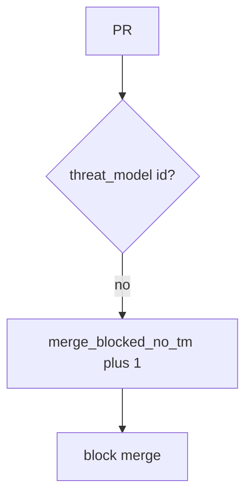

# 10.1-LO-06 — Detect merge_blocked_no_tm without logging tokens

**Kind:** operations-exercise
**Loop step:** 6 Operate
**Standards:** NIST CSF 2.0 (final) DE/RS/RC as outcome labels; NIST SSDF 1.1 (final) PW.1. ASVS 5.0.0 (final) `v5.0.0-15.1.5` Level 3 **advanced**.

## Prevention is not absolute

A new identity PR can land after `merge_ok` was “fixed once.” Pair detect and recover. Do not log GitHub tokens or real org names (5.3). Do not paste private threat-model bodies into Slack.

## Mental model: missing TM is a signal



| Outcome | This module |
|---|---|
| Detect | `merge_blocked_no_tm` |
| Signal | pr id, author synthetic id, TM present/absent; never tokens |
| Recover | Add a TM id; re-run merge_ok |
| Residual | Stale TM; docs exemptions; vanity KPIs |

CSF 2.0 Detect / Respond / Recover name outcomes. They do not prove PW.1. A training-product name is not the property. Re-run `test_merge_requires_threat_model_id` after any merge-bot change; a green “CODEOWNERS required” tile is not that pytest. Stale TM-12 that never mentions OAuth is a 3.2 residual — inventory it before claiming Recover.

## Framework defaults versus the operate guarantee

GitHub’s audit log is not this lab’s TCB. A SAMM dashboard will show process scores and stay silent when CI’s `merge_ok` is always true. Detection must observe **empty PR is deny**, not poster counts. If the alert includes a GitHub token, you have opened a 5.3 cell.

## Practice

Write one log line you would accept. Tie it to `labs/10.1/10.1-lab`.

```text
log_denied reason=merge_blocked_no_tm pr=123
```

Reject any line that includes a token, a real org name, or “Gate 10 complete.”

## Transfer

Clinic: block an identity PR with no TM id; do not paste HIPAA training certificates into the ticket. Do not change a live org.

## Usability

A refused merge must say *why* (missing threat-model id), not only “assert False” (WCAG 2.2 Success Criterion 4.1.3 for human-read CI).

Cause vs impact stays split here too: the **cause** is merge without a threat-model id; the **impact** is an identity surface that 3.2 never modelled; **prevention** is the truthy `threat_model` check; **detection** is `merge_blocked_no_tm`; **recovery** is add a TM id and re-run `merge_ok`. Mechanism limit: this alert does not prove TM-12 covers this PR’s files, and it does not replace 3.2 authorship or 10.4 governance evidence.

## Non-goals

A GitHub-product name is not the property. Gate 10 / M4 stay not-attempted. CISA Secure by Design stays unverified. SSDF 1.2 IPD stays draft.
