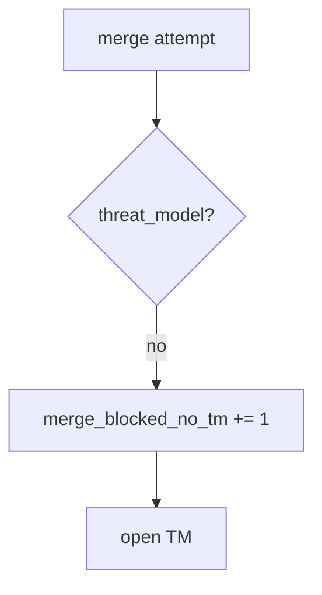

# 10.1-LO-06 — Detect merge_blocked_no_tm without logging bodies

**Kind:** operations-exercise
**Loop step:** 6 Operate
**Standards:** NIST CSF 2.0 (final) DE/RS/RC as outcome labels; NIST SSDF 1.1 PW.1.

## Prevention is not absolute

A hotfix can skip the field. Pair detect and recover. Do not log note bodies from the PR diff (3.1).

## Mental model: missing TM is a signal



| Outcome | This module |
|---|---|
| Detect | `merge_blocked_no_tm` |
| Signal | PR id, surface; never bodies |
| Recover | Open TM, then merge; hotfix still records after |
| Residual | Stale ids; vanity KPIs |

## Practice

Write one log line you would accept. Tie it to `labs/10.1/10.1-lab`.

```
log_denied reason=merge_blocked_no_tm pr=pr_101e surface=authz
```

Reject any line that includes a note body or “Gate 10 complete.”

## Transfer

Clinic: block merge; do not attach patient charts to the TM ticket.

## Non-goals

A culture-poster product is not the property. M4 stays not-attempted.
