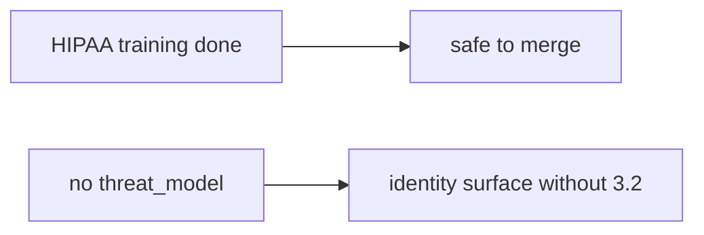

# Same idea: clinic HIPAA training as merge

**Kind:** transfer-challenge
**Loop step:** 7 Transfer

## Use it somewhere new

The notes-app scaffolding goes away. You get a **clinic that treats “HIPAA training complete” as enough to merge**. Your job is to rewrite the loop, not to name a bug-list code.

The notes-app sentence was: `merge_ok({})` must be false. Rewrite it for a clinic without changing the fork: empty change is deny; a threat-model id may merge. A training checkbox is still a belief, not a threat model.

**Product sketch:** an EHR-lite “CODEOWNERS plus annual HIPAA training so we merge identity changes,” plus a maturity score on a slide.

## Picture: same check, clinical training

Renaming “note” to “chart” is not transfer. Surfaces, threat-model id, and leftover change. Marking HIPAA training complete does not put `threat_model` on the change.

| Notes app this week | Clinic sketch |
|---|---|
| Empty change must not merge | Empty change must not merge |
| `merge_ok({})` | `merge_ok({})` on a local practice files |
| Schedule pressure | Same actor — **not** a live clinic |
| `{"threat_model": "TM-12"}` may merge | Same dict on the local practice files |
| CODEOWNERS is who clicks | CODEOWNERS plus a training checkbox |

If training is complete while `merge_ok` is always true, the rule is gone. CODEOWNERS, a maturity score, and a “secure by design” pledge do not put `threat_model` on the change. This topic is **cite a threat-model id**; 3.2 is **write the model**. Training without `merge_ok` produces binders. `merge_ok` without 3.2 produces citations of empty documents. You need both. A later draft of the design-review guide stays a draft. An unverified manufacturer-ownership page stays unverified.

The clinic rewrite still has to keep the notes-app fork: empty change denied, TM-12 may merge. Turning on CODEOWNERS without a merge check leaves `merge_ok({})` true. The local pytest analogue is `test_merge_requires_threat_model_id` — on a practice, not a live GitHub org.

Also name the exception path (E6): an exception still names the missing threat model and when it expires.

## Prompt — clinic HIPAA training as merge

Rewrite the notes-app sentence. Include:

1. who can act (schedule pressure — not a live clinic);
2. what you trust (the merge check is the promise; CODEOWNERS, training, and a maturity score are not);
3. what must not happen (`merge_ok({})` true, not a legal label);
4. a test idea on a **local** practice files only (no live GitHub org);
5. leftover (stale threat-model id, vanity ticket counts, exceptions without expiry);
6. whether a human merge path exists (must say which surface needs a threat-model id).

Use fake labels. Do not use real patient names. Also name the E6 exception path.

## What is not good enough

| Reject | Why |
|---|---|
| “CODEOWNERS” | Who clicks, not what changed |
| Live GitHub org | Course rules |
| “Secure by design certified” | The pin is unverified; not `merge_ok` |
| “Maturity Level 3” as `merge_ok` | Measurement, not the check |
| “Gate 10 is complete” | Forbidden stamp |
| “Later draft certified” | Still a draft |

## Practice

One page. No answer keys. `labs/10.1/10.1-lab` is the only running system you may break. Do not change a live org.

## What this page is not doing

Live-org merge rules. Auto-generating threat models. Real patient charts. Claiming you finished Gate 10 or M4 from this page.
