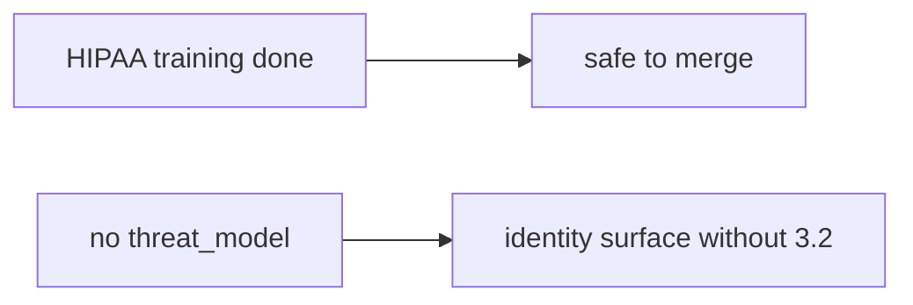

# 10.1-LO-07 — Transfer: clinic HIPAA training as merge

**Kind:** transfer-challenge
**Loop step:** 7 Transfer
**Standards:** NIST SSDF 1.1 PW.1. SAMM 2.0 as vocabulary. CISA Secure by Design remains **unverified**.

## Change the workplace; keep training from meaning TM

Do not answer with a Top 10 / CWE / scanner as the definition of security.

**Prompt:** Clinic: “HIPAA training complete” as merge. Also name the E6 exception path.

**Product sketch:** EHR-lite “CODEOWNERS plus annual HIPAA training so we merge identity PRs,” plus a SAMM score on a slide.

Rewrite the SecureCollab sentence. Include:

1. attacker capabilities (schedule pressure — not a live clinic);
2. trust assumptions (merge predicate is TCB; CODEOWNERS/training/SAMM are not);
3. forbidden outcome (`merge_ok({})` true, not “HIPAA”);
4. a test idea on a **local** fixture only;
5. residual (stale tm-id, vanity KPIs, E6);
6. WCAG if a human merge path exists (say which surface needs a TM).

## Mental model: training vs 3.2

## What graders reject

| Reject | Why |
|---|---|
| “CODEOWNERS” | Who clicks, not what changed |
| Live GitHub org | Lab policy |
| “Secure by Design certified” | Pin is unverified; not merge_ok |

## Practice

One page. No keys. `labs/10.1/10.1-lab` is the only running system you may break.
