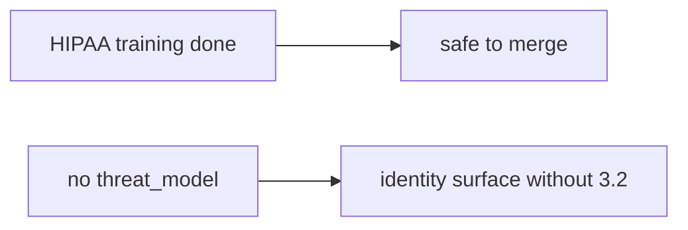

# 10.1-LO-07 — Transfer: clinic HIPAA training as merge

**Kind:** transfer-challenge
**Loop step:** 7 Transfer
**Standards:** NIST SSDF 1.1 PW.1. SAMM 2.0 as vocabulary. CISA Secure by Design remains **unverified**. ASVS `v5.0.0-15.1.5` Level 3 **advanced**. SSDF 1.2 IPD remains **draft**.

## Change the workplace; keep training from meaning TM

Do not answer with a Top 10 / CWE / scanner as the definition of security. The SecureCollab sentence was: `merge_ok({})` must be false. Rewrite it for a clinic without changing the fork.

**Prompt:** Clinic: “HIPAA training complete” as merge. Also name the E6 exception path.

**Product sketch:** EHR-lite “CODEOWNERS plus annual HIPAA training so we merge identity PRs,” plus a SAMM score on a slide.

Rewrite the SecureCollab sentence. Include:

1. attacker capabilities (schedule pressure — not a live clinic);
2. trust assumptions (merge predicate is TCB; CODEOWNERS/training/SAMM are not);
3. forbidden outcome (`merge_ok({})` true, not “HIPAA”);
4. a test idea on a **local** fixture only;
5. residual (stale tm-id, vanity KPIs, E6);
6. WCAG if a human merge path exists (say which surface needs a TM).

## Mental model: training vs 3.2

If training is complete while `merge_ok` is always true, the cell is gone. CODEOWNERS, SAMM, and a Secure by Design pledge do not put `threat_model` on the PR. Module 10.1 is **cite a TM id**; module 3.2 is **write the model**. Training without `merge_ok` produces binders. `merge_ok` without 3.2 produces citations of empty documents. You need both. SSDF 1.2 IPD is draft; 1.1 PW.1 is the final pin. CISA Secure by Design stays unverified.

The clinic rewrite still has to keep the SecureCollab fork: empty PR denied, TM-12 may merge. Enabling CODEOWNERS without a merge predicate leaves `merge_ok({})` true. The local pytest analogue is `test_merge_requires_threat_model_id` — on a fixture, not a live GitHub org.

## What graders reject

| Reject | Why |
|---|---|
| “CODEOWNERS” | Who clicks, not what changed |
| Live GitHub org | Lab policy |
| “Secure by Design certified” | Pin is unverified; not merge_ok |
| “SAMM Level 3” as merge_ok | Measurement, not the predicate |
| “Gate 10 is complete” | Forbidden stamp |
| “SSDF 1.2 certified” | IPD draft |

## Practice

One page. No keys. `labs/10.1/10.1-lab` is the only running system you may break. Do not change a live org.

## Non-goals

Live-org merge rules. Auto-generating threat models. Claiming Gate 10 or M4 from this page.
