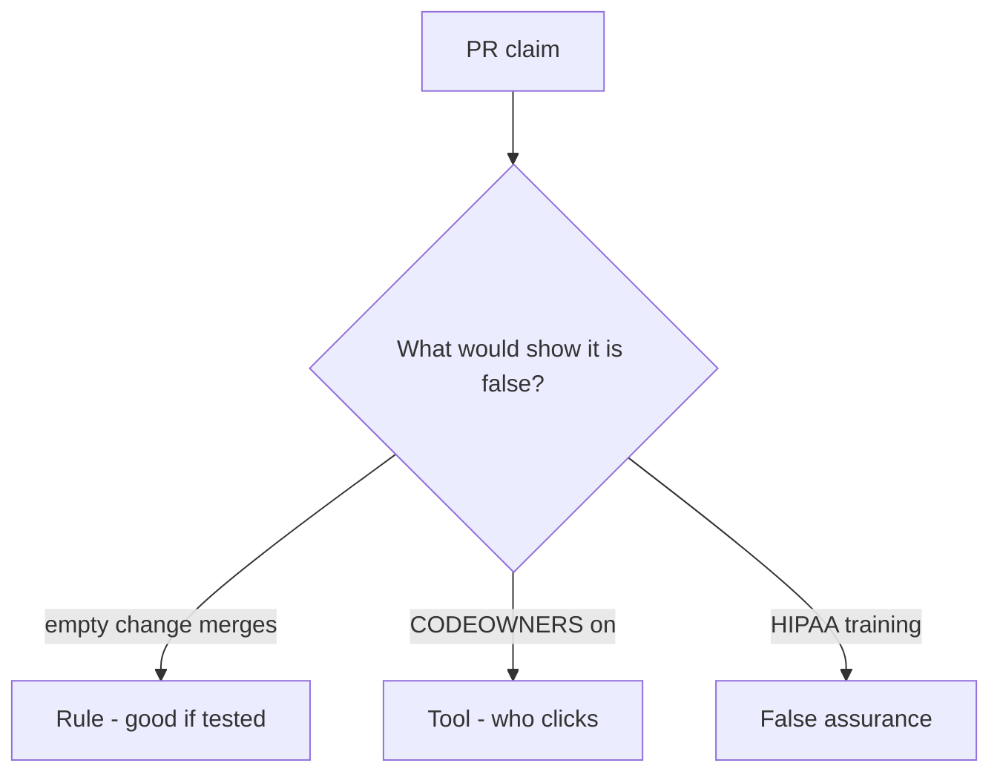

# Would you merge this always-true merge_ok?

**Kind:** code-review
**Loop step:** Review

## What you are reviewing

Open `labs/10.1/10.1-lab/vulnerable/` as if it were a merge-check PR. Does `merge_ok({})` still return true?

Look at `merge_ok` and the empty dict. A training screenshot is not the merge check. “Will add a threat model later” is a promise; `test_merge_requires_threat_model_id` is the evidence.

## Picture: merge_ok True without a threat-model id

**`merge_ok` True without a threat-model id**.

An empty change still has to be denied. If the change never checks a truthy `threat_model`, that always-merge path is still open. A training screenshot does not replace that check.

Stale TM-12 is 3.2. Governance evidence is 10.4. Do not claim Gate 10. Do not change a live org to prove the finding.

## Problems to find (name them yourself)

- `merge_ok` True without a threat-model id
- Pull-request template asks for a threat model but CI never calls `merge_ok`
- Design-review practice claimed from a README mention
- Gate 10 stamped after this check
- An unverified “secure by design” page treated as a product
- Obsolete requirement numbers from an older checklist

Also reject: live orgs; merging without re-running `test_merge_requires_threat_model_id`; keys in learner notes; claiming M4.

## Common mix-ups

- HIPAA training is a threat model
- CODEOWNERS is 3.2
- A maturity score is `merge_ok`
- An unverified “secure by design” page is a verified pin
- A later draft of the design-review guide is final
- Gate 10 follows from a green merge bot

## Use it somewhere new

Annual HIPAA training without a merge check does not prove the culture. What still has to be on the change so empty threat-model ids cannot merge?

## Can people still use it

A human exception path must say which surface still needs a threat-model id and when the exception expires. A CODEOWNERS ping is not the exception text.

## What this page is not doing

You cannot waive a missing threat-model id with “will add a threat model later.” Assign an owner or keep the finding open. Do not change a live GitHub org to prove the finding.
