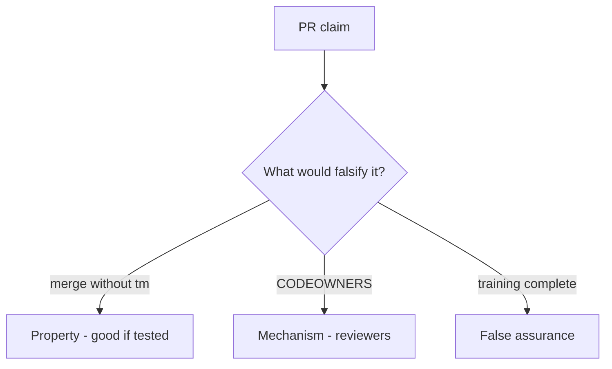

# 10.1-LO-08 — Review always-true merge_ok as a PR

**Kind:** code-review
**Loop step:** Review
**Standards:** NIST SSDF 1.1 PW.1. OWASP SAMM 2.0 as vocabulary.

## Review the fixture as if it were SecureCollab’s merge gate

Review `labs/10.1/10.1-lab/vulnerable/` as a SecureCollab PR. Intended findings live only in `content/assessment/keys/10.1.md` — not here.

## Mental model: merge_ok True without tm

Start with this seeded smell: **merge_ok True without tm**. Label it property, mechanism, or false assurance before you accept the PR.

Seeded smells (label them yourself; do not open the keys file):

- merge_ok True without tm
- Security champion optional forever
- Vanity vuln-count KPI
- No change-trigger matrix

Also reject: live orgs, keys in lessons, claiming Gate 10 or M4.

## Misconceptions

- CODEOWNERS is a threat model
- A security-champion poster is the merge gate
- Vuln-count KPIs are outcome metrics

## Practice

Write three review notes. Tie at least one to `test_merge_requires_threat_model_id`.

## Transfer

Clinic PR that “everyone finished HIPAA training” without a TM field is incomplete.
