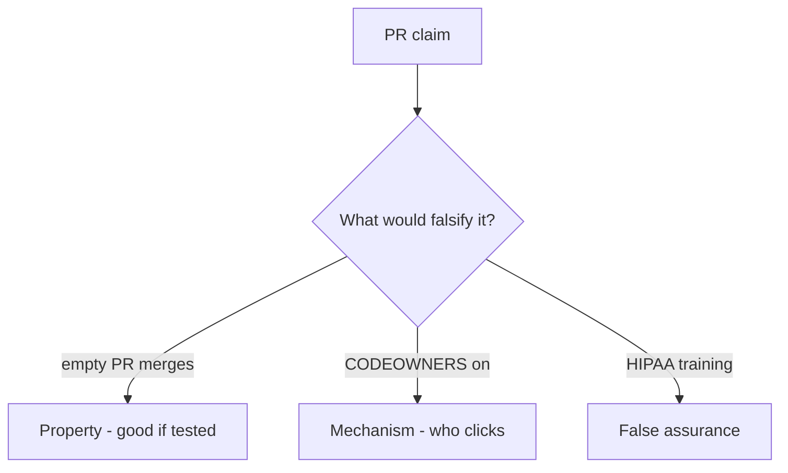

# 10.1-LO-08 — Review always-true merge_ok as a PR

**Kind:** code-review
**Loop step:** Review
**Standards:** NIST SSDF 1.1 (final) PW.1. SAMM 2.0 as vocabulary. CISA Secure by Design **unverified**. ASVS `v5.0.0-15.1.5` Level 3 **advanced**.

## Review the fixture as if it were SecureCollab’s merge gate

Review `labs/10.1/10.1-lab/vulnerable/` as a SecureCollab PR. Your job is not to count suspicious lines. Reconstruct whether `merge_ok({})` still returns true, compare that with the module invariant, and write changes a developer can verify.

Intended findings live only in `content/assessment/keys/10.1.md` — not here. Do not open the keys file until your review has been evaluated.

## Mental model: merge_ok True without tm

Start with this seeded smell: **`merge_ok` True without tm**. Label it property, mechanism, or false assurance before you accept the PR.

Classification starts at the protected effect (empty PR denied). Everything that is not a truthy `threat_model` at that call is a candidate always-merge path. A training screenshot without that pytest is the same smell, not a different finding class.

Stale TM-12 is 3.2. Governance evidence is 10.4. Do not skip `test_merge_requires_threat_model_id`. Do not claim Gate 10. Do not change a live org to prove the finding.

## Seeded smells (label them yourself)

- `merge_ok` True without tm
- PR template asks for TM but CI never calls `merge_ok`
- SSDF PW.1 claimed from a README mention
- Gate 10 stamped after this pytest
- CISA Secure by Design treated as verified
- ASVS 4.x ids

Also reject: live orgs; merging without re-running `test_merge_requires_threat_model_id`; keys in lessons; claiming M4.

## Misconceptions this module refuses

- HIPAA training is a threat model
- CODEOWNERS is 3.2
- SAMM score is `merge_ok`
- CISA Secure by Design is a verified pin
- SSDF 1.2 IPD is final
- Gate 10 follows from a green merge bot

## Practice

Write three review notes a maintainer could act on. Each note: observation, property or false assurance, suggested structural change, residual you will **not** delete. Tie at least one to `test_merge_requires_threat_model_id`.

## Transfer

Clinic PR that “added annual HIPAA training” without a merge predicate is an incomplete culture review. Name the independent falsehood that would still keep empty PRs from merging.

## Non-goals

Do not merge by adding a comment “will add TM later.” That comment is a residual without an owner. Do not change a live GitHub org to prove the finding.
