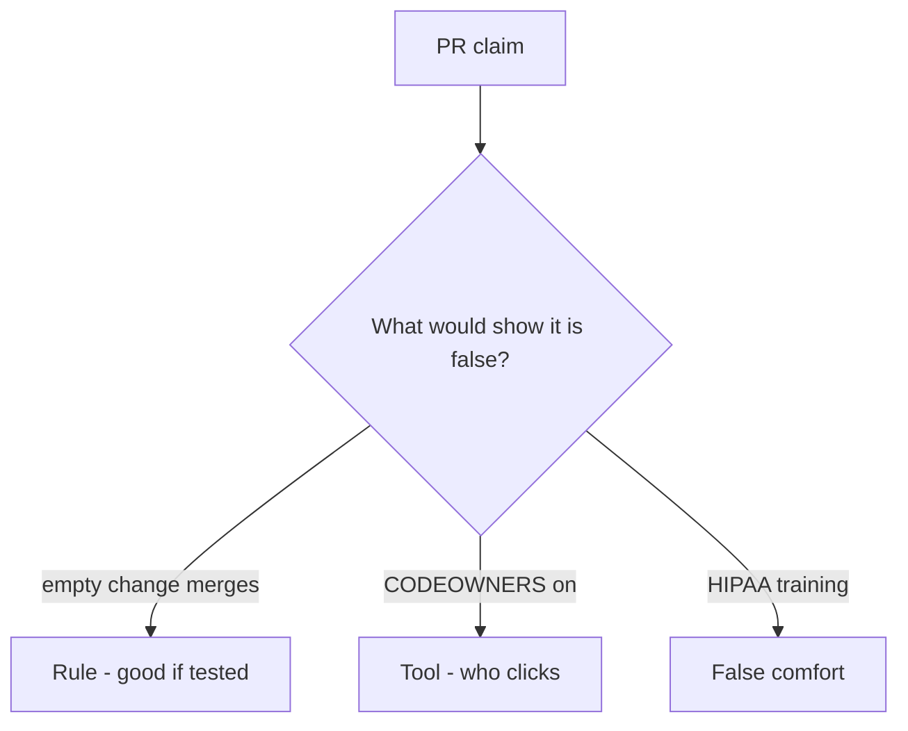

# Review always-true merge_ok like a pull request

**Kind:** code-review
**Loop step:** Review

Intended findings live only in the answer-key folder — not here. Do not open that file until your review has been evaluated.

## What you are reviewing

A colleague ships the notes app’s merge check. Review `labs/10.1/10.1-lab/vulnerable/` as that change. Your job is not to count suspicious lines. Reconstruct whether `merge_ok({})` still returns true, compare that with the rule, and write changes a developer can verify.

Start at `merge_ok` and the empty dict, not at a scanner color or a training screenshot. The check you already ran (`test_merge_requires_threat_model_id`) is the rule test. A comment “will add a threat model later” is not.

## Picture: merge_ok True without a threat-model id

Start with this seeded smell: **`merge_ok` True without a threat-model id**. Label it rule, tool, or false comfort before you accept the change.

Classification starts at the protected effect (empty change denied). Everything that is not a truthy `threat_model` at that call is a candidate always-merge path. A training screenshot without that pytest is the same smell, not a different finding class.

Stale TM-12 is 3.2. Governance evidence is 10.4. Do not skip `test_merge_requires_threat_model_id`. Do not claim Gate 10. Do not change a live org to prove the finding.

## Problems to find (name them yourself)

- `merge_ok` True without a threat-model id
- Pull-request template asks for a threat model but CI never calls `merge_ok`
- Design-review practice claimed from a README mention
- Gate 10 stamped after this pytest
- An unverified “secure by design” page treated as a product
- Obsolete requirement numbers from an older checklist

Also reject: live orgs; merging without re-running `test_merge_requires_threat_model_id`; keys in learner notes; claiming M4.

## Common mix-ups

- HIPAA training is a threat model
- CODEOWNERS is 3.2
- A maturity score is `merge_ok`
- An unverified “secure by design” page is a verified pin
- A later draft of the design-review guide is final
- Gate 10 follows from a green merge bot

## Practice

Write three review notes a maintainer could act on. Each note: what you saw, rule or false comfort, suggested structural change, leftover you will **not** delete. Tie at least one note to `test_merge_requires_threat_model_id`. Do not open the keys file.

## Use it somewhere new

Clinic change that “added annual HIPAA training” without a merge check is an incomplete review of the culture. Name the independent falsehood that would still keep empty changes from merging.

## Can people still use it

A human exception path must say which surface still needs a threat-model id and when the exception expires. Do not hide the gap behind “see CODEOWNERS.”

## What this page is not doing

Do not merge by adding a comment “will add a threat model later.” That comment is leftover without an owner. Do not change a live GitHub org to prove the finding.
