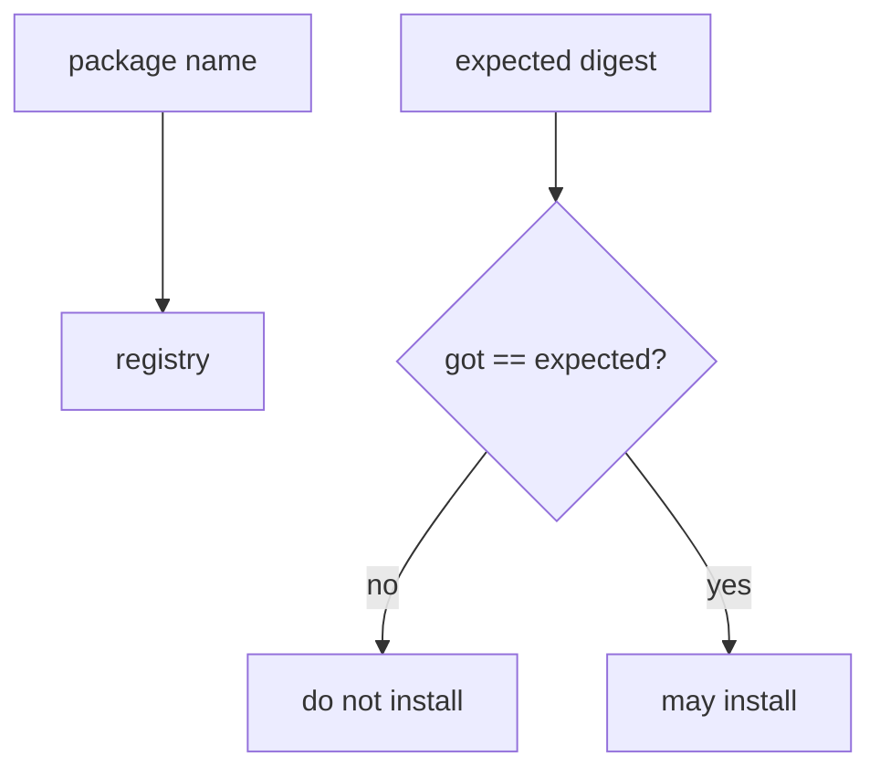
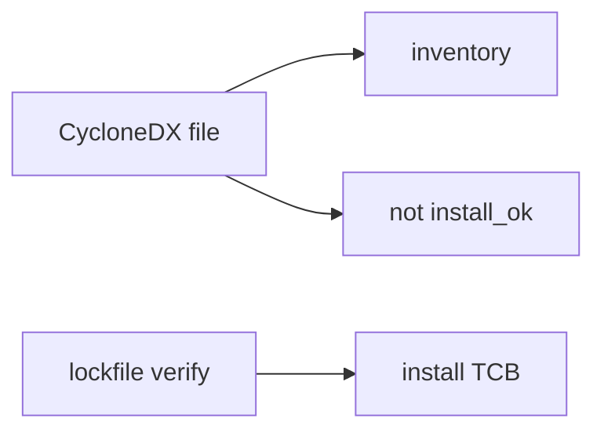

# A name is not a digest

**Kind:** concept-model
**Loop step:** 1 Property

## The rule

The notes app’s CI installs Python and JavaScript libraries from a lockfile. **Integrity of what you will run** is whether the bytes match the pinned digest. A package *name*, Dependabot, an SBOM file, or a provenance badge is not that check.

> `install_ok("aaa", "bbb")` must be false. `install_ok("aaa", "aaa")` may be true.

Install with a digest mismatch is the lockfile miss. That is integrity of the artifact you will run — someone else’s code inside the trusted computing base.

An SBOM is inventory — *what* you think you have. Provenance says *how* the artifact was built. Neither one is `install_ok`. A lookalike package on a public index wins when you install by name. Generating the SBOM file is still not the hash check.

## Picture: a name is not a digest



## Picture: lockfile verify vs SBOM inventory



npm audit, Dependabot, a provenance badge, and “we have an SBOM” do not compare digests.

## Why it happens, what it costs, how you stop it, how you notice, how you recover

| Slice | For this rule |
|---|---|
| Why it happens | Name-only install |
| What's already wrong | `install_ok('aaa','bbb')` true |
| Trigger | Lookalike name or a swapped tarball |
| What it costs | Wrong bytes in the trusted computing base |
| How you stop it | Hash pin; deny install scripts; provenance as extra |
| How you notice | `hash_mismatch_denied` |
| How you recover | Pin known-good; rotate CI secrets (5.3) |

## What the framework does vs what you still have to check

pip and npm will fetch a name. A lockfile that is not *checked* is documentation. A private registry still serves whatever was published.

`aaa` vs `bbb` is deny — files in `labs/10.2/10.2-lab`. Fake digest strings only. No live registries.

## What the tool cannot do

- Pinning a malicious 1.2.3 still installs malware — you still need review plus provenance.
- A Git dependency that tracks a moving branch.
- A compromised runner or a poisoned build cache.
- An unpinned `action@v1`.

## Can people still use it

A CI failure must say *digest mismatch* in words, not only a red X. Do not hide the reason behind color.

## Practice

Name the lockfiles and who can change them. Then run:

```text
python3 -m pytest labs/10.2/10.2-lab/tests --impl vulnerable
python3 -m pytest labs/10.2/10.2-lab/tests --impl fixed
```

## Use it somewhere new

GitHub Actions third-party `action@v1`. `npm install` in a prod pod is the same unpinned fetch.

## What this page is not doing

Do not use live registry attacks. This page does not finish the ship check-in. Answer keys are not on this site.
