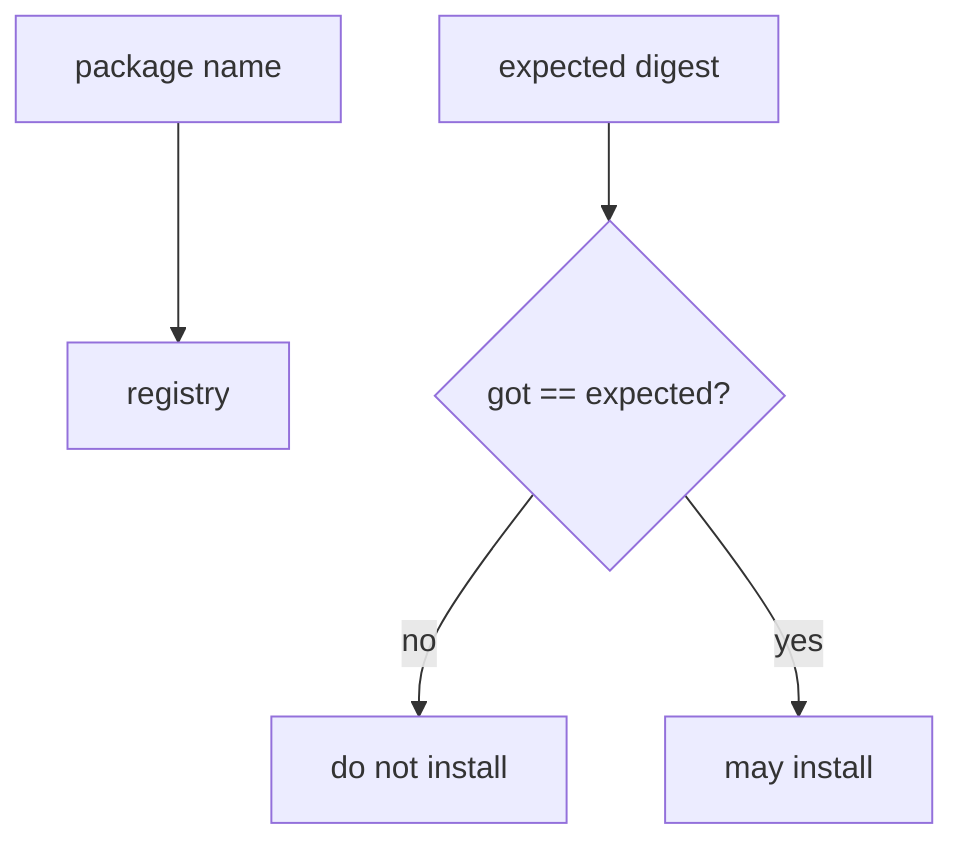
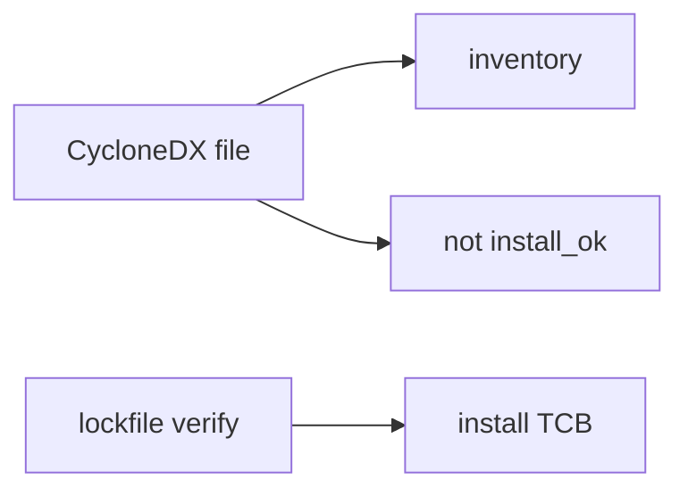

# 10.2-LO-01 — A name is not a digest

**Kind:** concept-model
**Loop step:** 1 Property
**Standards:** SLSA 1.2 (final) as provenance vocabulary. CISA 2026 SBOM (final) as inventory. ASVS `v5.0.0-15.1.2`, `v5.0.0-13.3.1`; `v5.0.0-15.2.4` is **Level 3, advanced**. OpenSSF OSPS 2026-08-28. NIST SP 800-161r1-upd1.

## The claim this module owns

SecureCollab CI installs Python/JS dependencies from a lockfile. **Integrity of build inputs** is whether the bytes match the pinned digest. A package *name*, Dependabot, an SBOM file, or a SLSA badge is not that check.

> `install_ok("aaa", "bbb")` must be false. `install_ok("aaa", "aaa")` may be true.

The forbidden outcome is **dependency installed when digest mismatches lockfile**. That is integrity of the artifact you will run — malicious code in the TCB.

ASVS `v5.0.0-15.1.2` wants an SBOM inventory — *what* you think you have. `v5.0.0-13.3.1` wants secrets out of artifacts (5.3 / 8.4). `v5.0.0-15.2.4` (dependency confusion) is **Level 3, advanced**: a name-only install is how that grain wins. SLSA 1.2 provenance says *how* the artifact was built; it does not replace digest match. CISA 2026 SBOM minimum elements add fields (hashes, signatures) — generating the file is still not `install_ok`.

## Mental model: name vs digest



## Mental model: SBOM is inventory



**Mechanism (not the property):** npm audit, Dependabot, SLSA badge, “we have an SBOM.”

## Root cause vs impact vs prevention vs detection vs recovery

| Slice | For this property |
|---|---|
| Root cause | Name-only install |
| Preconditions | `install_ok('aaa','bbb')` true |
| Trigger | Typosquat or swapped tarball |
| Impact | Malicious code in the TCB |
| Prevention | Hash pin; deny install scripts; provenance as extra |
| Detection | `hash_mismatch_denied` |
| Recovery | Pin known-good; rotate CI secrets (5.3) |

## Framework defaults versus the install guarantee

pip/npm will fetch a name. A lockfile that is not *checked* is documentation. Private registries still serve whatever was published.

## Mechanism limits

- Pinning a malicious 1.2.3 still installs malware — review + provenance.
- Git dependency to a moving branch.
- Compromised runner; build cache poisoning.
- Unpinned `action@v1`.

## Usability and accessibility

CI failure must say *digest mismatch* in text, not only a red X (WCAG 2.2 4.1.3).

## Practice

Name lockfiles and who can change them. Then run:

```
python3 -m pytest labs/10.2/10.2-lab/tests --impl vulnerable
python3 -m pytest labs/10.2/10.2-lab/tests --impl fixed
```

The first command must fail. The second must pass.

## Transfer

GitHub Actions third-party `action@v1`. Clinic: npm install in prod pod.

## Non-goals

Live registry attacks, claiming Gate 10 or M4. Answer keys are not in this file.
