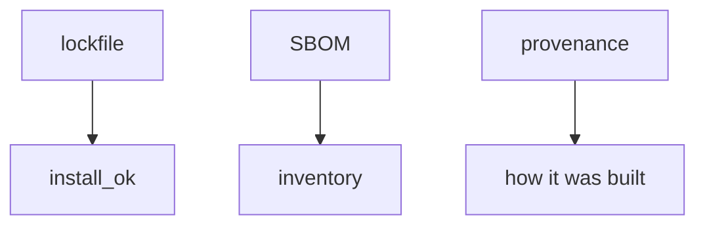
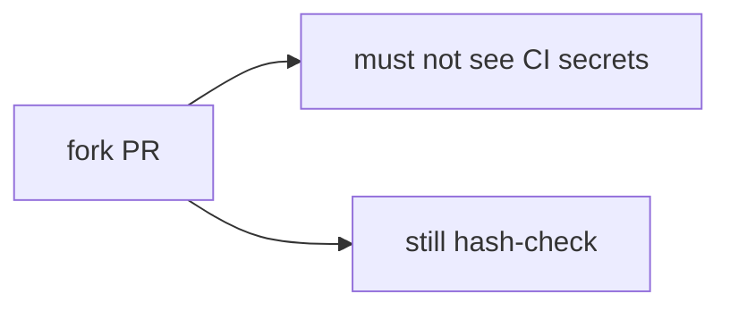

# Lockfile verify vs SBOM inventory

**Kind:** design-exercise
**Loop step:** 2 Model

## Could someone else name the install check?

“We generate CycloneDX” is not this lesson. A drawing someone else can test names **the expected digest, the got digest, who can edit the lockfile, and that a fork pull request stays untrusted**.

This week’s freeze for the notes app: local `install_ok(expected, got)`. No live registries.

> For a mismatch, `aaa` vs `bbb` is deny. A matching pair may install. Evidence that the deny is false: `install_ok("aaa", "bbb")` returns true.

If the expected-vs-got cell is blank, the SBOM looks finished because nobody named the hash check.

## Picture: two artifacts

## Picture: a fork pull request is untrusted

Lockfile verify is the install check. An SBOM is inventory. Provenance is extra. A fork pull request must not see CI secrets, and it still has to hash-check.

## Step 1: name the pieces

Do not invent a new catalogue. Take the install rule you already have and ask which check would show it is false.

| Piece | This system |
|---|---|
| Who | Lookalike publisher; compromised maintainer; fork PR |
| What | Lockfile digest; tarball |
| Actions | `install_ok` |
| Paths | CI install |
| What you trust for this journey | Digest equality |
| What you do not trust | Package name; SBOM file; provenance badge |
| Time | Cache; a tag that moves |
| The rule | Integrity of the artifact you will run |

## Step 2: write allow and deny

| Who | What | Action | Decision |
|---|---|---|---|
| mismatch aaa/bbb | install | allow | deny |
| match aaa/aaa | install | allow | may allow |
| SBOM present | install | treat as verify | deny |
| unpinned action@v1 | workflow | treat as pinned | deny |

A missing hash-compare cell is how a package name becomes false assurance. Write the hole.

## Practice

Draw the map so someone else could name the checks. Point at `labs/10.2/10.2-lab` file `lock.py`.

## Use it somewhere new

`action@v1` is a moving tag — same grain as a name-only install.

## What can still go wrong

Pinned malware. Cache poisoning. A lookalike package that wins because you still install by name.

## What this page is not doing

Do not define security as a famous-bugs list. Answer keys are not on this site.
