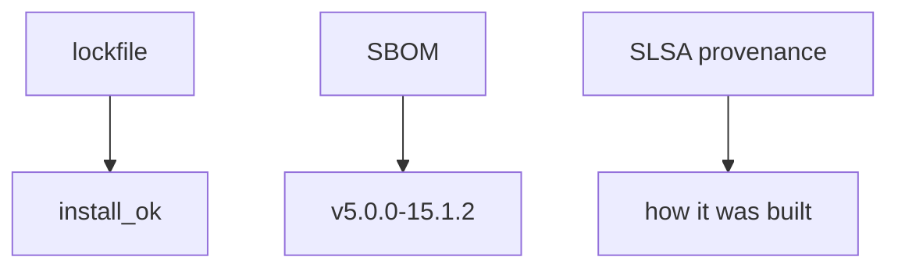
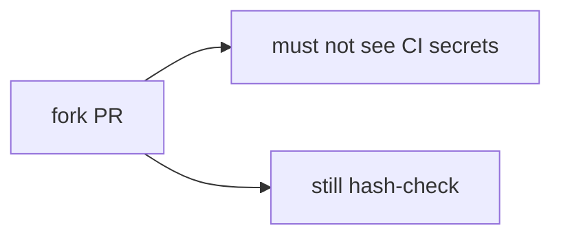

# 10.2-LO-02 — Lockfile verify vs SBOM inventory

**Kind:** design-exercise
**Loop step:** 2 Model
**Standards:** ASVS `v5.0.0-15.1.2`. SLSA 1.2. CISA 2026 SBOM.

## Can a second engineer name the install check from your pipeline map?

“We generate CycloneDX” is not this lesson. A reviewable model names **expected digest, got digest, who can edit the lockfile, and fork-PR isolation**.

SecureCollab freeze: local `install_ok(expected, got)`. No live registries.

## Mental model: two artifacts

## Mental model: fork PR is untrusted

## Step 1: freeze pieces

| Piece | This system |
|---|---|
| Subjects | typosquat; compromised maintainer; fork PR |
| Objects | lockfile digest; tarball |
| Actions | `install_ok` |
| Channels | CI install |
| TCB | digest equality |
| Untrusted | package name; SBOM file; SLSA badge |
| State / time | cache; tag moves |
| 1.1 cell | integrity of the artifact you will run |

## Step 2: write cells

| Subject | Object | Action | Decision |
|---|---|---|---|
| mismatch aaa/bbb | install | allow | deny |
| match aaa/aaa | install | allow | may allow |
| SBOM present | install | treat as verify | deny |
| unpinned action@v1 | workflow | treat as pinned | deny |

## Practice

Draw the map. Point at `labs/10.2/10.2-lab` file `lock.py`.

## Transfer

`action@v1` is a moving tag — same grain as a name-only install.

## Residual risk

Pinned malware; cache poisoning; `v5.0.0-15.2.4` Level 3.

## Non-goals

Top 10 as the definition of security. Keys stay out of lessons.
