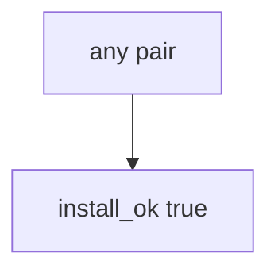

# 10.2-LO-03 — Observe always-true install_ok, do not attack registries

**Kind:** mechanism-lab
**Loop step:** 3 Break
**Standards:** OWASP ASVS 5.0.0 (final) `v5.0.0-15.1.2`, `v5.0.0-13.3.1`. `v5.0.0-15.2.4` dependency confusion is **Level 3, advanced**. SLSA 1.2 as provenance vocabulary. CISA 2026 SBOM as inventory. Lab policy: local only.

## Authorized scope

`labs/10.2/10.2-lab` only. The fixture is an in-process `install_ok(expected_hash, got_hash)`. Synthetic digest strings `aaa` / `bbb`. Do **not** publish, typosquat, or fetch live packages as the exercise.

**Forbidden outcome:** Dependency installed when digest mismatches lockfile. `install_ok("aaa", "bbb")` returns true.

Attacker capability in this lab: a name-only install. That stands in for “prod pod runs npm install so we always get latest,” a CycloneDX file treated as verify, or a SLSA badge treated as 1.2. Trust assumption: `install_ok` is supposed to require **expected digest equals got digest**. npm audit, Dependabot, SBOM generation, and FastAPI defaults are not in the TCB for this cell.

## Mental model: name is enough



The vulnerable tree demonstrates **cause** (name-only install). Do not probe public registries. Preconditions: `install_ok` returns true for every pair. You do not need npm. You must not fetch a live package.

ASVS `v5.0.0-15.1.2` wants an SBOM inventory — *what* you think you have. Module 5.3 already said secrets stay out of artifacts (`v5.0.0-13.3.1`); this cell is **wrong bytes must not enter the TCB**. Gate 10 and M4 stay **not-attempted**.

## What to read in the fixture

`vulnerable/lock.py` returns true for every pair. Tests:

- `test_hash_mismatch_refuses_install`
- `test_matching_digest_may_install` — matching hashes may pass on both

You do not need a new digest string. The failure of `test_hash_mismatch_refuses_install` *is* the evidence.

Do not open the fixed tree yet. Diagnose the cause first.

## Root cause vs impact vs prevention vs detection vs recovery

| Slice | This lab |
|---|---|
| Required property | `install_ok("aaa", "bbb")` is false |
| Root cause | Name-only install; digests ignored |
| Preconditions | `install_ok` true for every pair |
| Trigger | CI installs when claimed digest ≠ got |
| Impact | Wrong bytes in the TCB |
| Prevention | Require expected == got; mismatch deny |
| Detection | `hash_mismatch_denied`; never registry tokens |
| Recovery | Pin known-good; rotate CI secrets (5.3) |
| Not the lesson | An SBOM product; live npm; Gate 10 complete |

## Framework defaults versus the install guarantee

`npm install` latest is a convenience default. Dependabot opens PRs; it does not verify bytes at install. FastAPI pip install without `--require-hashes` will take whatever the index returns. The application guarantee is: **this** fixture, `aaa` vs `bbb` is deny.

## Practice

```text
python3 -m pytest labs/10.2/10.2-lab/tests --impl vulnerable
```

Run from `labs/10.2/10.2-lab` if a repo-root collection picks up `site/`. Record `test_hash_mismatch_refuses_install`. Do not probe public hosts. An environment error is not security evidence.

## Transfer

Clinic npm in prod: predict without leaving this directory. Do not typosquat a live registry.

## Non-goals

No live-registry, typosquat, or poison-PR instructions against real orgs. Do not claim Gate 10 or M4.
