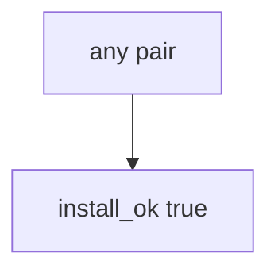

# Practice: always-true install_ok

**Kind:** mechanism-lab
**Loop step:** 3 Break

## Try it

The practice is not a registry you attack. It is a tiny Python `install_ok(expected_hash, got_hash)` that returns true or false. The failure is already in the function: every pair is allowed. You are here to see that the check treats that as a **failed rule**, not as a missing package name.

The rule under test:

> A digest mismatch must not install. If `install_ok("aaa", "bbb")` is true, the bytes you will run have failed as a security control.

## Where you may practice

Only `labs/10.2/10.2-lab` is in scope. The practice is an in-process `install_ok(expected_hash, got_hash)`. The digests are the synthetic strings `aaa` and `bbb`. No live registries, no public indexes, no clinic clusters. Do not fetch a live package.

Do not publish, typosquat, or pull a real tarball “to see what happens.” Do not paste this exercise onto a public registry, employer CI, or live clinic.

What is supposed to stop this: `install_ok` is supposed to require **expected digest equals got digest**. npm audit, Dependabot, SBOM generation, and framework install defaults are not enough.

Who can slip a wrong tarball in this story: a name-only install. That stands in for “the prod pod runs npm install so we always get latest,” a CycloneDX file treated as verify, or a provenance badge treated as the hash check.

## Picture: any pair is enough



The broken files take that path on purpose. You do not need npm. You must not fetch a live package. The true return *is* the leak of integrity.

The first lesson already refused a name as a digest. This practice is **whether the check compares bytes**. An SBOM is inventory. It does not compare `aaa` to `bbb`.

## What to look at — cause, not a dump

Read `vulnerable/lock.py`. It returns true for every pair. Tests:

- `test_hash_mismatch_refuses_install`
- `test_matching_digest_may_install` — matching hashes may pass on both

You do not need a new digest string. The failure of `test_hash_mismatch_refuses_install` *is* the evidence.

Do not open the repaired files yet. Diagnose the cause first.

| What you see | What kind of failure | Not the lesson |
|---|---|---|
| Any pair returns true | Name-only install; digests ignored | “We have an SBOM” |
| `install_ok("aaa", "bbb")` true | Always-true `install_ok` used as the payload | A green Dependabot job |
| No equality required | The sink accepted a name | “We use npm audit” |

## Why it happens vs what it costs

| Slice | Practice |
|---|---|
| The rule | `install_ok("aaa", "bbb")` is false |
| Why it happens | Name-only install; digests ignored |
| What has to be true first | `install_ok` true for every pair |
| Trigger | CI installs when claimed digest ≠ got |
| What it costs | Wrong bytes in the trusted computing base |
| How you stop it later | Require expected == got; mismatch deny |
| How you notice later | `hash_mismatch_denied`; never registry tokens |
| How you recover later | Pin known-good; rotate CI secrets (5.3) |
| Out of scope | An SBOM product, live npm, or claiming the ship gate |

`npm install` latest is a convenience default. Dependabot opens pull requests; it does not verify bytes at install. A pip install without a hash requirement will take whatever the index returns. The app’s promise this week is: **this** practice, `aaa` vs `bbb` is deny.

## Practice

From the repository root, in a throwaway environment:

```text
python3 -m pytest labs/10.2/10.2-lab/tests --impl vulnerable
```

Run from `labs/10.2/10.2-lab` if a collection at the repo root picks up `site/`. Record `test_hash_mismatch_refuses_install`. Do not probe public hosts. A setup error is not proof the rule holds.

## Use it somewhere new

A clinic example: predict npm install in a prod pod — still only this directory. Do not typosquat a live registry.

## What this page is not doing

No live-registry, typosquat, or poison-PR steps against real orgs. Fake `aaa` / `bbb` only. Do not dump real tokens into the practice files. Do not “fix” the practice by deleting the test.
