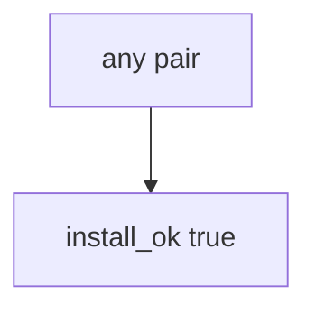

# 10.2-LO-03 — Observe always-true install_ok, do not attack registries

**Kind:** mechanism-lab
**Loop step:** 3 Break
**Standards:** ASVS `v5.0.0-15.1.2`. Lab policy: local only.

## Authorized scope

`labs/10.2/10.2-lab` only. Synthetic digest strings `aaa` / `bbb`. Do **not** publish, typosquat, or fetch live packages as the exercise.

**Forbidden outcome:** Dependency installed when digest mismatches lockfile.

## Mental model: name is enough



The vulnerable tree demonstrates **cause** (name-only install). Do not probe public registries.

## What to read in the fixture

`vulnerable/lock.py` returns true for every pair. Tests require `install_ok("aaa", "bbb")` to be false.

## Root cause vs impact

| Slice | Lab |
|---|---|
| Root cause | Name-only install |
| Impact | Wrong bytes in the TCB |
| Not the lesson | An SBOM product as the definition |

## Practice

```
python3 -m pytest labs/10.2/10.2-lab/tests --impl vulnerable
```

Record `test_hash_mismatch_refuses_install`. Do not probe public hosts.

## Transfer

Clinic npm in prod: predict without leaving this directory.

## Non-goals

No live-registry, typosquat, or poison-PR instructions against real orgs.
