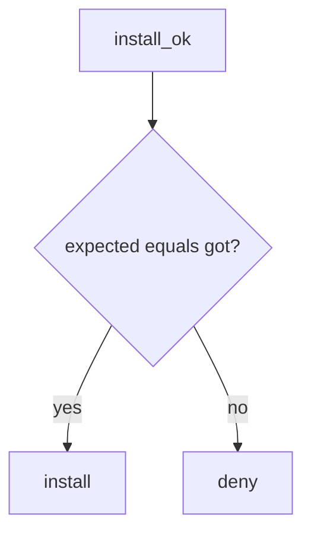

# 10.2-LO-04 — Require expected hash equals got hash

**Kind:** design-exercise
**Loop step:** 4 Build
**Standards:** ASVS 5.0.0 (final) `v5.0.0-15.1.2`. SLSA 1.2 as extra, not the predicate.

## Structural means install compares digests

`install_ok` must return `expected_hash == got_hash`. Fail-safe: mismatch denies. Provenance and SBOM may *accompany* a match; they do not replace it.

## Mental model: equality gate



Do not accept “SBOM lists the package” as equality.

## Why this restores the cell

| After the fix | Must be true |
|---|---|
| aaa vs bbb | install false |
| aaa vs aaa | install true |

## What this is not

Dependabot. SLSA badge. CISA SBOM file. Gate 10 / M4. Pinning malware (residual).

## Practice

Name who can edit the lockfile. Run:

```
python3 -m pytest labs/10.2/10.2-lab/tests --impl fixed
```

Must pass.

## Transfer

Pin Actions by SHA, not `@v1`.

## Residual risk

Malicious pin; cache poisoning; `v5.0.0-15.2.4` Level 3; secrets in fork PRs (5.3).
