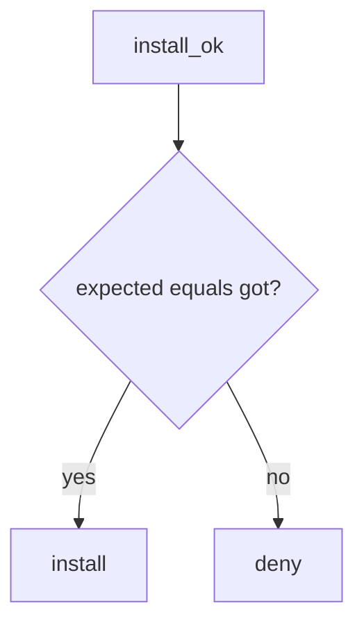

# 10.2-LO-04 — Require expected hash equals got hash

**Kind:** design-exercise
**Loop step:** 4 Build
**Standards:** ASVS 5.0.0 (final) `v5.0.0-15.1.2`. SLSA 1.2 as extra, not the predicate. `v5.0.0-15.2.4` is **Level 3, advanced**. CISA 2026 SBOM as inventory.

## Structural means install compares digests

`install_ok` must return `expected_hash == got_hash`. Fail-safe: mismatch denies. Provenance and SBOM may *accompany* a match; they do not replace it. Structural means that equality — not package name, not Dependabot, not a SLSA badge.

The smallest restore for SecureCollab CI is: `aaa` vs `bbb` → do not install. Do not fail open because “the SBOM lists the package.” Do not accept `@v1` as a digest.

## Mental model: equality gate



The lab’s fixed tree requires equality. Production still needs the pin to be *benign* — matching a malicious digest is a lying lockfile. Who can edit the lockfile is 10.1 / CODEOWNERS, not this predicate. `v5.0.0-15.2.4` (dependency confusion) is Level 3 advanced: a name-only install is how that grain wins; equality is the local stand-in.

SLSA 1.2 provenance says *how* the artifact was built. It does not replace digest match. CISA 2026 SBOM minimum elements add hash fields — generating the file is still not `install_ok`.

## Why this restores the cell

| After the fix | Must be true |
|---|---|
| aaa vs bbb | install false |
| aaa vs aaa | install true |

## What this is not

Dependabot. SLSA badge. CISA SBOM file. Gate 10 / M4. Pinning malware (residual). npm audit. pip without `--require-hashes` as the TCB.

## Mechanism limits

- Matching a malicious pin still installs in this lab.
- Cache poisoning can serve old bytes after a good pin.
- Unpinned GitHub Actions `@v1` is a sibling grain, not this pytest.
- Secrets in fork PRs remain 5.3.
- `v5.0.0-15.2.4` Level 3 confusion still needs index policy beyond equality.

## Practice

Name who can edit the lockfile. Run:

```text
python3 -m pytest labs/10.2/10.2-lab/tests --impl fixed
```

Must pass. Run from the lab directory if collection at repo root is polluted.

## Transfer

Pin Actions by SHA, not `@v1`. That is the same equality idea on a different object.

## Residual risk

Malicious pin; cache poisoning; `v5.0.0-15.2.4` Level 3; secrets in fork PRs (5.3).

## Non-goals

Do not fetch a live package. Do not claim Gate 10 from an SBOM screenshot. Do not present a SLSA badge as 1.2.
