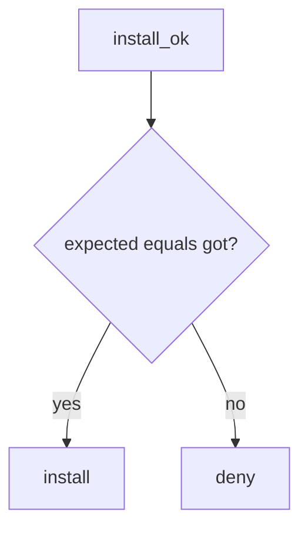

# Require expected hash equals got hash

**Kind:** design-exercise
**Loop step:** 4 Build

## The rule

Those package names are not a digest check. A silenced finding does not compare hashes. Generating an SBOM is still a slogan.

Repair this: `install_ok` **returns `expected_hash == got_hash`**. A mismatch denies. Provenance and an SBOM may *sit next to* a match; they do not replace it. Here: that equality — not package name, not Dependabot, not a provenance badge.

For the notes app’s CI: `aaa` vs `bbb` → do not install. An SBOM listing the package does not match the digest. `@v1` is not a digest.

## Picture: equality is the gate



Install has to compare digest equality. Matching a malicious digest is a lying lockfile — the pin still has to be benign. Who can edit the lockfile is 10.1 / CODEOWNERS, not this check. A lookalike package still wins if you install by name somewhere else; equality is the local stand-in.

Provenance says *how* the artifact was built. It does not replace digest match. An SBOM can list hashes — generating the file is still not `install_ok`.

## What the repaired files must show

Treat `fixed/lock.py` as a hash compare, not `npm install`.

| After the fix | Must be true |
|---|---|
| aaa vs bbb | install false |
| aaa vs aaa | install true |

If the hashes do not match, do not install. An SBOM listing the name does not mean it may install.

## What this is not

- Dependabot.
- A provenance badge.
- A CISA-style SBOM file treated as verify.
- A ship-check sticker because you opened this lesson.
- Pinning malware (leftover).
- npm audit.
- pip without a hash requirement as the trusted check.

## What the tool cannot do

- Matching a malicious pin still installs in this lab.
- Cache poisoning can serve old bytes after a good pin.
- Unpinned GitHub Actions `@v1` is a sibling grain, not this check.
- Secrets in fork pull requests remain 5.3.
- A lookalike on a public index still needs index policy beyond equality.

## Can people still use it

A denied install must say *digest mismatch* in words, not only “assert False.” Do not hide the reason behind a red X.

## Practice

Name who can edit the lockfile. Run:

```text
python3 -m pytest labs/10.2/10.2-lab/tests --impl fixed
```

## Use it somewhere new

Pin Actions by SHA, not `@v1`. That is the same equality idea on a different object.

## What can still go wrong

Malicious pin. Cache poisoning. Unpinned actions. Secrets in fork pull requests (5.3). A lookalike package that never hits this equality check.
