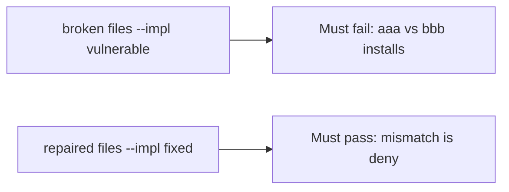

# A broken install check must fail the mismatch test

**Kind:** verification-lab
**Loop step:** 5 Verify

## Check it

“SBOM generated” is not evidence. “Provenance badge” is a how-it-was-built observation. The check is: `install_ok("aaa", "bbb")` is false and matching hashes may install. That mismatch observation must be **false** on the broken files and **true** on the repaired files. Do not fetch live packages.

## Picture: a broken install check must fail the mismatch test

A passing-test tally can still hide that always-true `install_ok` still installs a mismatch.



If both pass, you are not looking at digest equality.

## What the check has to show

| Mode | Must show for this topic |
|---|---|
| Normal | match → may install (may pass on both) |
| Wrong input | mismatch → not install; broken files must fail |
| Abuse | Unsure hashes are deny (fail closed) |
| Not claimed | Live npm; provenance builders; the ship gate; that the pin is benign |

The test `test_hash_mismatch_refuses_install` is there so always-true `install_ok` still fails.

Honest matching hashes may pass on both implementations. That does not excuse the mismatch deny test. If the broken files do not fail `test_hash_mismatch_refuses_install`, the lab is miswired — fix the wiring, not the assertion.

```text
python3 -m pytest labs/10.2/10.2-lab/tests --impl vulnerable
python3 -m pytest labs/10.2/10.2-lab/tests --impl fixed
```

A test that only greps `CycloneDX` in CI without calling `install_ok("aaa", "bbb")` is not this topic’s evidence. This practice never opens a live registry.

## What the tests do not prove

- That the pin is benign
- That provenance is authentic
- Cache isolation
- Index policy against lookalike packages
- The ship gate complete

## Practice

```text
python3 -m pytest labs/10.2/10.2-lab/tests --impl vulnerable
python3 -m pytest labs/10.2/10.2-lab/tests --impl fixed
```

Reject a “test” that only greps `CycloneDX` in CI without calling `install_ok("aaa", "bbb")`.

## Use it somewhere new

A clinic example: a test that only asserts “npm ci ran” is not this topic. A live registry is out of scope.

## What this page is not doing

Do not treat a live npm screenshot as proof. Do not log registry tokens. Answer keys are not on this site. This page does not finish the ship check-in.
