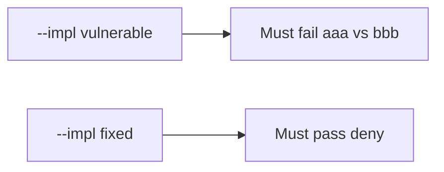

# 10.2-LO-05 — Evidence is mismatch denied, then a passing pair

**Kind:** verification-lab
**Loop step:** 5 Verify
**Standards:** ASVS `v5.0.0-15.1.2`.

## An invariant that cannot fail a test is still a slogan

“SBOM generated” is not evidence. The oracle is the local pair. Do not fetch live packages.

## Mental model: fail-on-vulnerable, pass-on-fixed



| Case | Must show |
|---|---|
| Negative / abuse | mismatch → not install |
| Normal | match → may install |
| Not claimed | live npm; SLSA builders; Gate 10 |

```
python3 -m pytest labs/10.2/10.2-lab/tests --impl vulnerable
python3 -m pytest labs/10.2/10.2-lab/tests --impl fixed
```

Honest matching hashes may pass on both.

## What the tests do not prove

- The pin is benign
- Provenance authenticity
- Cache isolation

## Practice

Execute both implementations. Map each test to an LO-02 cell.

## Transfer

Clinic: a test that only asserts “npm ci ran” is not this cell.
