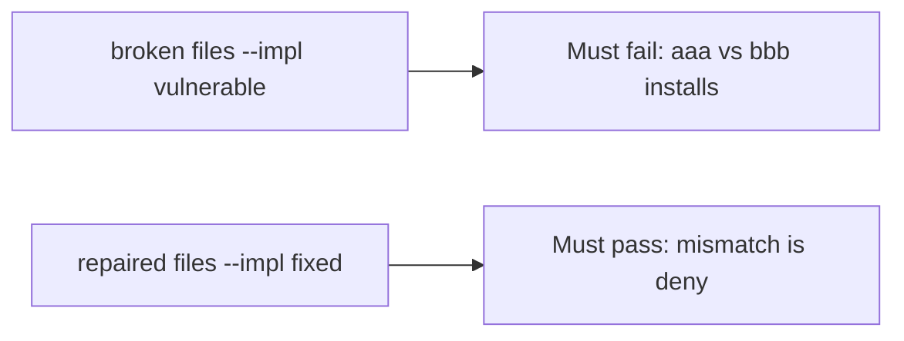

# A broken install check must fail the mismatch test

**Kind:** verification-lab
**Loop step:** 5 Verify

## Check it

Generating an SBOM does not compare hashes. A provenance badge is how-it-was-built theater. `install_ok("aaa", "bbb")` has to be false, and matching hashes may install. The leftover files: the mismatch still installs. Repair refuses `aaa` vs `bbb`. Do not fetch live packages.

## Picture: a broken install check must fail the mismatch test

Always-yes `install_ok` can still install a mismatch under a green suite.



If the broken install still passes, you never compared digests.

## What the check has to show

| Mode | Must show for this topic |
|---|---|
| Normal | match → may install (may pass on both) |
| Wrong input | mismatch → not install; broken files must fail |
| Abuse | Unsure hashes are deny (fail closed) |
| Not claimed | Live npm; provenance builders; the ship gate; that the pin is benign |

`test_hash_mismatch_refuses_install` is what stops `install_ok` from being a tautology.

Matching digests may pass on both sides. You still have to refuse a mismatch. If the broken files do not fail `test_hash_mismatch_refuses_install`, the lab is miswired — fix the wiring, not the assertion.

```text
python3 -m pytest labs/10.2/10.2-lab/tests --impl vulnerable
python3 -m pytest labs/10.2/10.2-lab/tests --impl fixed
```

A CycloneDX filename in CI is not `install_ok("aaa", "bbb")`. This practice never opens a live registry.

## What the tests do not prove

- That the pin is benign
- That provenance is authentic
- Cache isolation
- Index policy against lookalike packages
- The ship gate complete

## Practice

Call `install_ok("aaa", "bbb")`. A CycloneDX filename in CI is the SBOM, not the digest.

## Use it somewhere new

`npm ci` that ran is the install, not matching hashes. Do not use a live registry.

## What this page is not doing

A live npm screenshot is not matching hashes. Do not log registry tokens. Answer keys are not on this site. This page does not finish the ship check-in.
