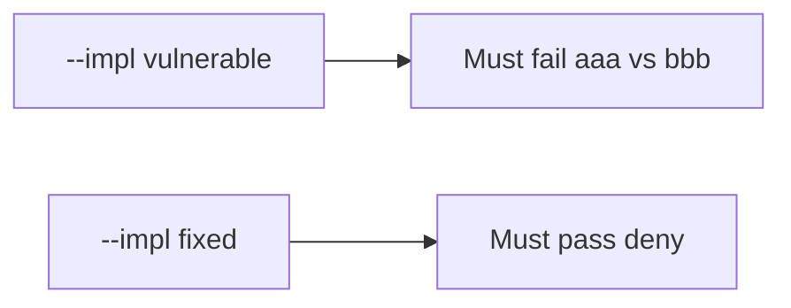

# 10.2-LO-05 — Evidence is mismatch denied, then a passing pair

**Kind:** verification-lab
**Loop step:** 5 Verify
**Standards:** ASVS `v5.0.0-15.1.2`. SLSA 1.2 as vocabulary, not the oracle.

## An invariant that cannot fail a test is still a slogan

“SBOM generated” is not evidence. “SLSA badge” is a provenance observation. The oracle is: `install_ok("aaa", "bbb")` is false and matching hashes may install. The mismatch observation must be **false** on `--impl vulnerable` (returns true) and **true** on `--impl fixed`. Do not fetch live packages.

## Mental model: digest mismatch must fail install

The failing observation on `--impl vulnerable` is installing when the claimed digest `aaa` does not match `bbb`. A passing collection count is not this cell.



| Mode | Must show for this module |
|---|---|
| Negative / abuse | mismatch → not install; digest mismatch must fail install |
| Normal | match → may install (may pass on both) |
| Not claimed | live npm; SLSA builders; Gate 10; that the pin is benign |

Lab tests in `labs/10.2/10.2-lab/tests/test_property.py`. `test_hash_mismatch_refuses_install` is a **forbidden-outcome** test: always-true `install_ok` is not allowed to count as a passing control.

```text
python3 -m pytest labs/10.2/10.2-lab/tests --impl vulnerable
python3 -m pytest labs/10.2/10.2-lab/tests --impl fixed
```

Honest matching hashes may pass on both implementations. That does not excuse the mismatch deny test. If vulnerable does not fail `test_hash_mismatch_refuses_install`, the lab is miswired—fix the wiring, not the assertion.

## What the tests do not prove

- The pin is benign
- Provenance authenticity (SLSA)
- Cache isolation
- `v5.0.0-15.2.4` Level 3 confusion policy
- Gate 10 / M4 complete

Record those as residuals or later modules, not as silent passes.

## Practice

Execute both implementations this session from the lab directory if needed. Write the fail/pass pair next to the matrix row. Reject a “test” that only greps `CycloneDX` in CI without calling `install_ok("aaa", "bbb")`.

## Transfer

Clinic: a test that only asserts “npm ci ran” is not this cell. A live registry is out of scope.

## Non-goals

Do not add a live-npm trophy. Do not log registry tokens. Keys stay out of this file. Gate 10 stays not-attempted.
