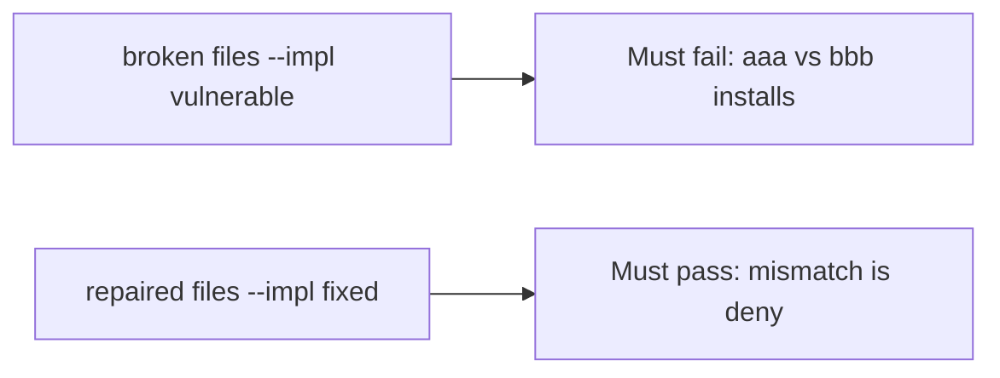

# Fail on the broken files, then pass on the repaired ones

**Kind:** verification-lab
**Loop step:** 5 Verify

## If you cannot test it, it is still a slogan

“SBOM generated” is not evidence. “Provenance badge” is a how-it-was-built observation. The check is: `install_ok("aaa", "bbb")` is false and matching hashes may install. That mismatch observation must be **false** on the broken files and **true** on the repaired files. Do not fetch live packages.

## Picture: a broken install check must fail the mismatch test

A test that only counts passing tests can pass while always-true `install_ok` still installs a mismatch. This check asks whether a digest mismatch still counts as a passing control. Broken must fail that question. Repaired must pass it.



If both pass, the test is not looking at digest equality. If both fail, the fix is not structural or the check is wrong.

## Four modes, even for two hash strings

| Mode | Must show for this topic |
|---|---|
| Normal | match → may install (may pass on both) |
| Wrong input | mismatch → not install; broken files must fail |
| Abuse | Unsure hashes are deny (fail closed) |
| Not claimed | Live npm; provenance builders; the ship gate; that the pin is benign |

The file is `labs/10.2/10.2-lab/tests/test_property.py`. The test `test_hash_mismatch_refuses_install` is a **what-must-not-happen** test: always-true `install_ok` is not allowed to count as a passing control.

Honest matching hashes may pass on both implementations. That does not excuse the mismatch deny test. If the broken files do not fail `test_hash_mismatch_refuses_install`, the lab is miswired — fix the wiring, not the assertion.

```text
python3 -m pytest labs/10.2/10.2-lab/tests --impl vulnerable
python3 -m pytest labs/10.2/10.2-lab/tests --impl fixed
```

A test that only greps `CycloneDX` in CI without calling `install_ok("aaa", "bbb")` is not this topic’s evidence. This practice never opens a live registry.

## What the tests do not prove

- That the pin is benign
- That provenance is authentic
- Cache isolation
- Index policy against lookalike packages
- The ship gate complete

Record those as leftover or later topics, not as silent passes.

## Practice

Run both this session from the lab directory if needed:

```text
python3 -m pytest labs/10.2/10.2-lab/tests --impl vulnerable
python3 -m pytest labs/10.2/10.2-lab/tests --impl fixed
```

Paste nothing from answer keys. Write fail/pass into your notes next to the mismatch row. Reject a “test” that only greps `CycloneDX` in CI without calling `install_ok("aaa", "bbb")`.

## Use it somewhere new

Clinic: a test that only asserts “npm ci ran” is not this topic. A live registry is out of scope.

## What this page is not doing

Do not add a live-npm trophy. Do not log registry tokens. Answer keys stay out of this file. The ship gate stays not-attempted.
