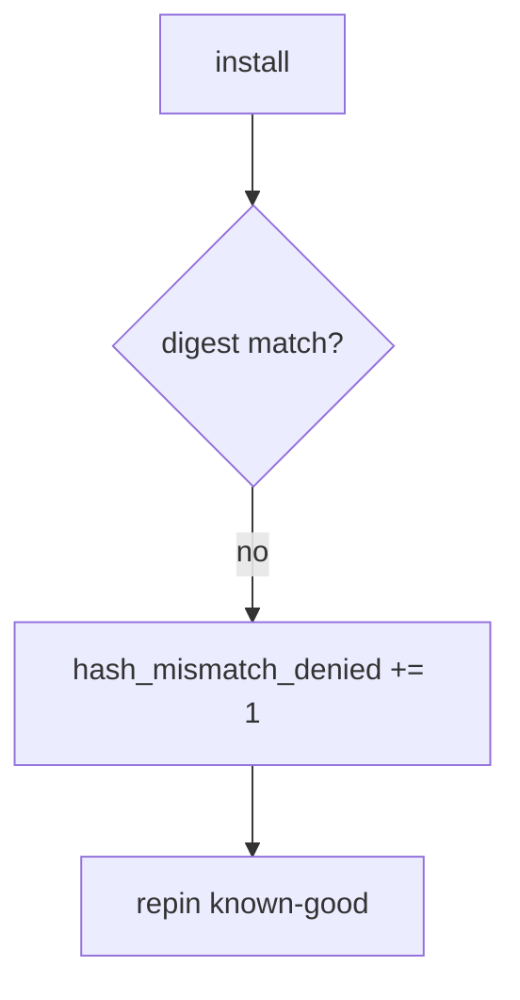

# 10.2-LO-06 — Detect hash_mismatch_denied without logging secrets

**Kind:** operations-exercise
**Loop step:** 6 Operate
**Standards:** NIST CSF 2.0 (final) DE/RS/RC as outcome labels; ASVS `v5.0.0-13.3.1`.

## Prevention is not absolute

A cache can serve old bytes. Pair detect and recover. Do not log registry tokens or signing keys (5.3).

## Mental model: mismatch is a signal



| Outcome | This module |
|---|---|
| Detect | `hash_mismatch_denied` |
| Signal | package name, expected vs got *ids*; never tokens |
| Recover | Pin known-good; rotate CI secrets |
| Residual | Malicious pin; cache poisoning |

## Practice

Write one log line you would accept. Tie it to `labs/10.2/10.2-lab`.

```
log_denied reason=hash_mismatch_denied pkg=demo expected=aaa got=bbb
```

Reject any line that includes a token, a private key, or “Gate 10 complete.”

## Transfer

Clinic: deny npm in the prod pod; do not paste `.npmrc` into the ticket.

## Non-goals

An SBOM-vendor name is not the property. M4 stays not-attempted.
