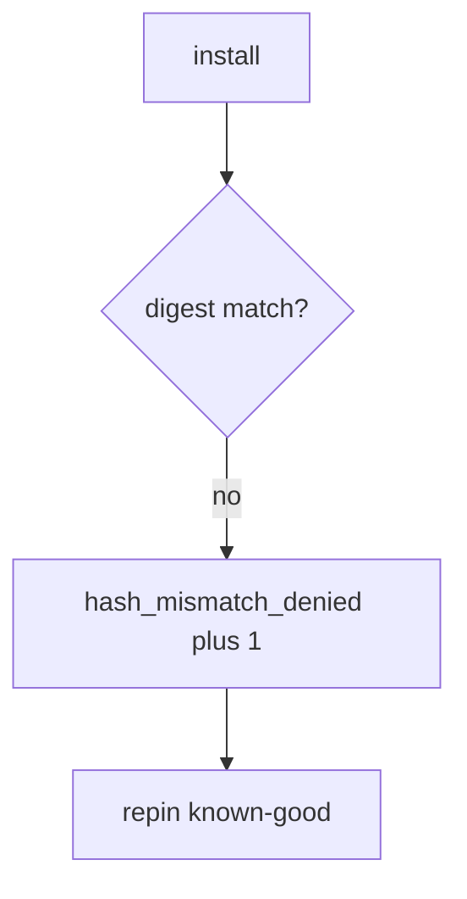

# Log the hash mismatch, not the secrets

**Kind:** operations-exercise
**Loop step:** 6 Operate

## Fixing it once is not enough

A cache can serve old bytes whose digest no longer matches the pin. Do not attach `.npmrc`, registry tokens, or signing keys.

## Picture: digest mismatch is a signal

If a digest does not match, page the package name and both digest ids — not the registry token. Then pin the known-good digest.



An SBOM vendor name does not prove the lockfile was checked.

A digest mismatch still has to refuse install in `test_hash_mismatch_refuses_install`. Attaching an SBOM does not compare digests. Cache poisoning and `@v1` Actions still install by name; the pin is not done until those paths are named.

## Signals that do not become a second leak

| Outcome | This topic |
|---|---|
| Notice | `hash_mismatch_denied` |
| What the line holds | Package name, expected vs got *ids*; **never** tokens |
| Respond | Stop the install that would take wrong bytes; do not paste registry tokens into chat |
| Recover | Pin known-good; rotate CI secrets |
| Leftover | Malicious pin; cache poisoning; unpinned actions |

npm audit can list a pile of advisories while CI’s `install_ok` is always true. Measure **aaa vs bbb is deny**, not CVE volume. A registry token next to the aaa-vs-bbb deny is the same leak as a log line (5.3).

```text
log_denied reason=hash_mismatch_denied pkg=demo expected=aaa got=bbb
```

A token, a private key, or “ship gate complete” in the install sample is a keyring.

A registry token in the install-deny ticket is another secret dump.

## What the framework does vs what you still have to check

An always-true installer, poisoned cache, and unpinned `@v1` Actions still install by name even if the advisory count is green. An SBOM file does not compare digests.

Why it broke: install without comparing digests. You pay wrong bytes in the trusted computing base. Repair with `expected_hash == got_hash`. The signal is `hash_mismatch_denied`. Then pin known-good and rotate CI secrets (5.3). This alert does not prove the pin is benign, does not authenticate provenance, and does not stop cache poisoning or `@v1` Actions. Equality is the local stand-in, not index policy.

## Can people still use it

A denied install must say *digest mismatch* in words, not only “assert False.” If operators see a mismatch badge, do not encode it as color only.

## Practice

```text
log_denied reason=hash_mismatch_denied pkg=demo expected=aaa got=bbb
```

A token, a private key, or “ship gate complete” would turn the log into a keyring.

## Use it somewhere new

Deny npm in the prod pod; do not paste `.npmrc` into the ticket. Do not fetch a live package.

## What this page is not doing

An SBOM attachment does not compare digests. Do not use live registry traces. This page does not finish the ship check-in. A provenance badge does not pin `@v1`. Answer keys are not on this site.
