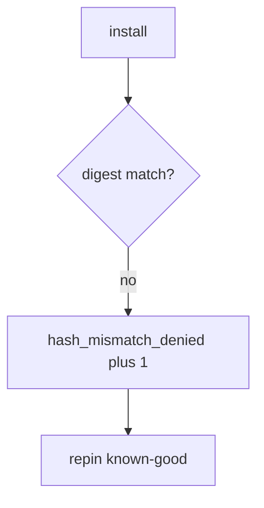

# 10.2-LO-06 — Detect hash_mismatch_denied without logging secrets

**Kind:** operations-exercise
**Loop step:** 6 Operate
**Standards:** NIST CSF 2.0 (final) DE/RS/RC as outcome labels; ASVS `v5.0.0-13.3.1`, `v5.0.0-15.1.2`.

## Prevention is not absolute

A cache can serve old bytes after `install_ok` was “fixed once.” Pair detect and recover. Do not log registry tokens or signing keys (5.3). Do not paste `.npmrc` into the ticket.

## Mental model: digest mismatch is a signal



| Outcome | This module |
|---|---|
| Detect | `hash_mismatch_denied` |
| Signal | package name, expected vs got *ids*; never tokens |
| Recover | Pin known-good; rotate CI secrets |
| Residual | Malicious pin; cache poisoning; unpinned actions |

CSF 2.0 Detect / Respond / Recover name outcomes. They do not prove `v5.0.0-15.1.2`. An SBOM-vendor name is not the property. Re-run `test_hash_mismatch_refuses_install` after any installer change; a green “SBOM attached” tile is not that pytest. Cache poisoning and `@v1` Actions are sibling grains — inventory them before claiming Recover.

## Framework defaults versus the operate guarantee

An npm audit dashboard will show advisory counts and stay silent when CI’s `install_ok` is always true. Detection must observe **aaa vs bbb is deny**, not CVE volume. If the alert includes a registry token, you have opened a 5.3 / `v5.0.0-13.3.1` cell.

## Practice

Write one log line you would accept. Tie it to `labs/10.2/10.2-lab`.

```text
log_denied reason=hash_mismatch_denied pkg=demo expected=aaa got=bbb
```

Reject any line that includes a token, a private key, or “Gate 10 complete.”

## Transfer

Clinic: deny npm in the prod pod; do not paste `.npmrc` into the ticket. Do not fetch a live package.

## Usability

A denied install must say *digest mismatch*, not only “assert False” (WCAG 2.2 Success Criterion 4.1.3 for human-read CI).

Cause vs impact stays split here too: the **cause** is install without comparing digests; the **impact** is wrong bytes in the TCB; **prevention** is `expected_hash == got_hash`; **detection** is `hash_mismatch_denied`; **recovery** is pin known-good and rotate CI secrets (5.3). Mechanism limit: this alert does not prove the pin is benign, does not authenticate SLSA provenance, and does not stop cache poisoning or `@v1` Actions. `v5.0.0-15.2.4` (dependency confusion) remains Level 3 advanced: equality is the local stand-in, not index policy.

## Non-goals

An SBOM-vendor name is not the property. M4 stays not-attempted. A SLSA badge is not this alert.
