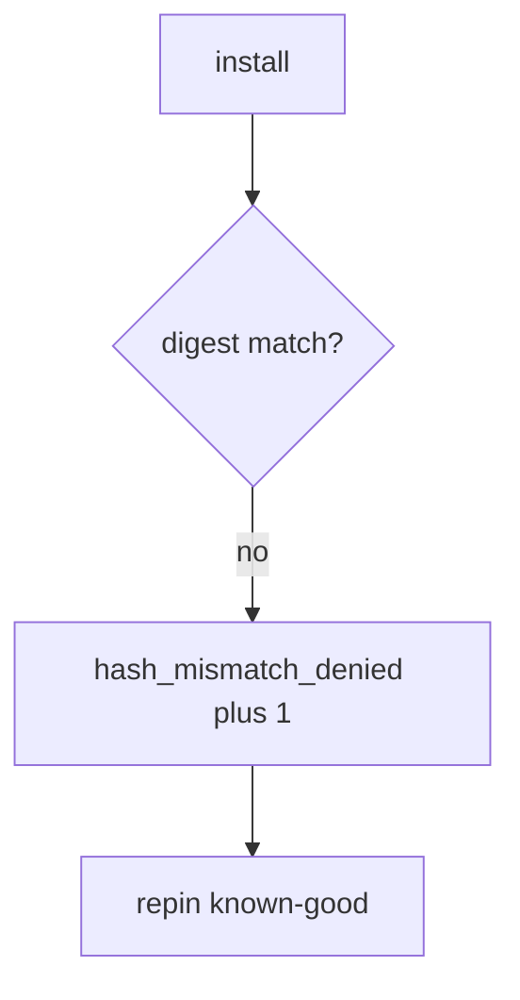

# Log the hash mismatch, not the secrets

**Kind:** operations-exercise
**Loop step:** 6 Operate

## Stopping it is not enough

A cache can serve old bytes after `install_ok` was “fixed once.” Pair notice and recover. Do not log registry tokens or signing keys (5.3). Do not paste `.npmrc` into the ticket.

## Picture: digest mismatch is a signal

A denied mismatch is a notice-and-recover problem, not a licence to quote a registry token in the paging channel. Notice names the package and the two digest ids. Recover pins known-good. Neither reprints a secret.



Noticing, responding, and recovering still need an owner. They do not pick an SBOM vendor. They do not prove the lockfile was checked.

Re-run `test_hash_mismatch_refuses_install` after any installer change. A green “SBOM attached” tile is not that check. Cache poisoning and `@v1` Actions are sibling grains — inventory them before you claim recover.

## Signals that do not become a second leak

| Outcome | This topic |
|---|---|
| Notice | `hash_mismatch_denied` |
| What the line holds | Package name, expected vs got *ids*; **never** tokens |
| Respond | Stop the install that would take wrong bytes; do not paste registry tokens into chat |
| Recover | Pin known-good; rotate CI secrets |
| Leftover | Malicious pin; cache poisoning; unpinned actions |

An npm audit dashboard will show advisory counts and stay silent when CI’s `install_ok` is always true. Detection must observe **aaa vs bbb is deny**, not CVE volume. If the alert includes a registry token, you have opened the same leak as a log line (5.3).

A log line a reviewer can accept looks like:

```text
log_denied reason=hash_mismatch_denied pkg=demo expected=aaa got=bbb
```

Not: a token, a private key, or “ship gate complete.”

If your alert includes the registry token, you have copied the leak into the paging channel.

## What the framework does vs what you still have to check

The same always-true installer, poisoned cache, and unpinned `@v1` Actions that bypass this practice will also bypass a “scan our advisory count” detector. Name those places before you claim recover. An SBOM-vendor name is not the rule.

Why it happens, what it costs, how you stop it, how you notice, how you recover stays split here too: the **cause** is install without comparing digests; the **cost** is wrong bytes in the trusted computing base; **how you stop it** is `expected_hash == got_hash`; **how you notice** is `hash_mismatch_denied`; **how you recover** is pin known-good and rotate CI secrets (5.3). What the tool cannot do: this alert does not prove the pin is benign, does not authenticate provenance, and does not stop cache poisoning or `@v1` Actions. Equality is the local stand-in, not index policy.

## Can people still use it

A denied install must say *digest mismatch* in words, not only “assert False.” If operators see a mismatch badge, do not encode it as color only.

## Practice

Write one log line you would accept in review. Tie it to `labs/10.2/10.2-lab`.

```text
log_denied reason=hash_mismatch_denied pkg=demo expected=aaa got=bbb
```

Reject any line that includes a token, a private key, or “ship gate complete.”

## Use it somewhere new

A clinic example: deny npm in the prod pod; do not paste `.npmrc` into the ticket. Do not fetch a live package.

## What this page is not doing

An SBOM-vendor name is not the rule. Live registry traces are out of scope. The ship gate stays not finished. A provenance badge is not this alert. Answer keys are not on this site.
