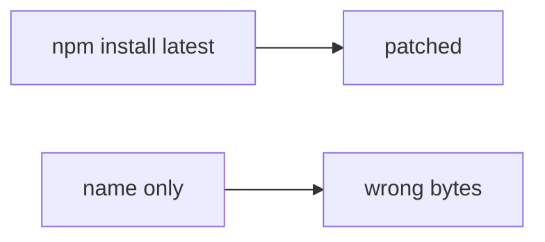

# Same idea on npm install in a clinic prod pod

**Kind:** transfer-challenge
**Loop step:** 7 Transfer

## Use it somewhere new

You get a **clinic that runs npm install in a prod pod**. A fake “always get latest” install sits next to an SBOM.

`install_ok("aaa", "bbb")` must be false. For a clinic, mismatch is deny; a matching pair may install. An SBOM is still inventory, not verify.

An EHR-lite “prod pod runs npm install so we always get latest,” plus “we attach a CycloneDX SBOM and a provenance badge.”

## Picture: latest vs lockfile

Here, “chart” is still “note” for this rule. Expected digest, got digest, and leftover change. Marking “npm install ran” does not compare hashes.

| Notes app | Clinic sketch |
|---|---|
| `install_ok("aaa", "bbb")` must be false | Same check on local practice files |
| Lockfile digest is the pin | Prod pod still needs a pin |
| Name-only install | “Always get latest” |
| Lookalike publisher | Same actor — **not** a live clinic registry |
| Equality in the function | Equality in the function |

If the pod installs “latest” while `install_ok` is always true, the rule is gone. CycloneDX, provenance badges, and Dependabot do not compare `aaa` to `bbb`. Pinning Actions by SHA is the same equality idea on a different object — name it, do not typosquat a live registry here. A lookalike package wins when you install by name. An SBOM is inventory, not verify.

A digest mismatch still has to be denied. A match may still install. Generating an SBOM without a digest check leaves `install_ok("aaa","bbb")` true. The local check is `test_hash_mismatch_refuses_install` — on a practice, not a live npm.

## Write this for a clinic npm install in a prod pod

1. who can act (lookalike / compromised maintainer — not a live clinic registry attack);
2. what you trust (digest equality is the promise; SBOM / provenance / Dependabot are not);
3. what must not happen (`install_ok("aaa","bbb")` true);
4. a test idea on **local** practice files only (no live npm);
5. leftover (malicious pin, cache poisoning, unpinned actions, lookalike packages);
6. whether a human-read CI path exists (must say digest mismatch in words).

Use fake labels. Do not use real clinic secrets. Also name GitHub Actions `action@v1`.

## What is not good enough

| Reject | Why |
|---|---|
| “We have an SBOM” | Inventory, not verify |
| Live npm / typosquat tutorial | Course rules |
| “A provenance badge so the hash check is done” | Provenance is not the install check |
| “Dependabot is on” | Signal, not digest equality |
| “Ship gate complete” | Forbidden stamp |

## Practice

Write one page. Leave the answer keys closed. `labs/10.2/10.2-lab` is the only running system you may break. Do not fetch a live package.

## What this page is not doing

Do not run live-registry attacks. Do not use real org poison-PRs. This page does not finish the ship gate.
