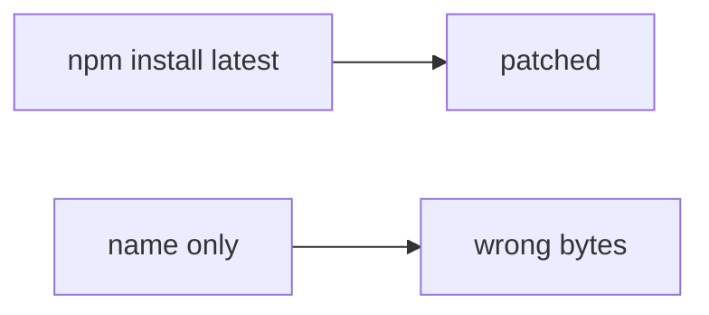

# 10.2-LO-07 — Transfer: clinic npm install in prod pod

**Kind:** transfer-challenge
**Loop step:** 7 Transfer
**Standards:** SLSA 1.2 as provenance. CISA 2026 SBOM as inventory. ASVS `v5.0.0-15.1.2`. `v5.0.0-15.2.4` Level 3 **advanced**.

## Change the workplace; keep name-only install from meaning integrity

Do not answer with a Top 10 / CWE / scanner as the definition of security. The SecureCollab sentence was: `install_ok("aaa", "bbb")` must be false. Rewrite it for a clinic without changing the fork.

**Prompt:** Clinic: npm install in prod pod. Also name GitHub Actions `action@v1`.

**Product sketch:** EHR-lite “prod pod runs npm install so we always get latest,” plus “we attach a CycloneDX SBOM and a SLSA badge.”

Rewrite the SecureCollab sentence. Include:

1. attacker capabilities (typosquat / compromised maintainer — not a live clinic registry attack);
2. trust assumptions (digest equality is TCB; SBOM/SLSA/Dependabot are not);
3. forbidden outcome (`install_ok("aaa","bbb")` true, not “HIPAA”);
4. a test idea on a **local** fixture only (no live npm);
5. residual (malicious pin, cache poisoning, unpinned actions, `v5.0.0-15.2.4` Level 3);
6. WCAG if CI is human-read (say digest mismatch).

## Mental model: latest vs lockfile

If the pod installs “latest” while `install_ok` is always true, the cell is gone. CycloneDX, SLSA badges, and Dependabot do not compare `aaa` to `bbb`. Pinning Actions by SHA is the same equality idea on a different object — name it, do not typosquat a live registry here. `v5.0.0-15.2.4` (dependency confusion) is Level 3 advanced: name-only install is how that grain wins. CISA 2026 SBOM is inventory, not verify.

The clinic rewrite still has to keep the SecureCollab fork: mismatch denied, match may install. Generating an SBOM without a digest check leaves `install_ok("aaa","bbb")` true. The local pytest analogue is `test_hash_mismatch_refuses_install` — on a fixture, not a live npm.

## What graders reject

| Reject | Why |
|---|---|
| “we have an SBOM” | Inventory, not verify |
| Live npm / typosquat tutorial | Lab policy |
| “SLSA L3 so 1.2 is done” | Provenance ≠ tenant isolation |
| “Dependabot is on” | Signal, not digest equality |
| “Gate 10 complete” | Forbidden stamp |

## Practice

One page. No keys. `labs/10.2/10.2-lab` is the only running system you may break. Do not fetch a live package.

## Non-goals

Live-registry attacks. Real org poison-PRs. Claiming Gate 10 or M4 from this page.
