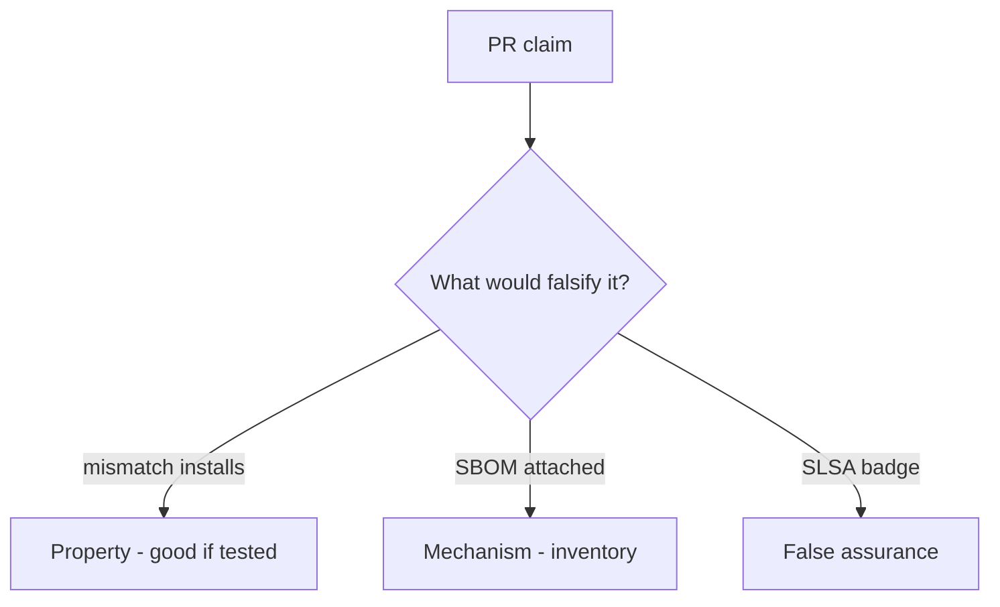

# 10.2-LO-08 — Review always-true install_ok as a PR

**Kind:** code-review
**Loop step:** Review
**Standards:** ASVS `v5.0.0-15.1.2`, `v5.0.0-13.3.1`. SLSA 1.2 as vocabulary.

## Review the fixture as if it were SecureCollab CI install

Review `labs/10.2/10.2-lab/vulnerable/` as a SecureCollab PR. Intended findings live only in `content/assessment/keys/10.2.md` — not here.

## Mental model: install_ok True on hash mismatch

Start with this seeded smell: **install_ok True on hash mismatch**. Label it property, mechanism, or false assurance before you accept the PR.

Seeded smells (label them yourself; do not open the keys file):

- install_ok True on hash mismatch
- Unpinned action
- Secrets in PR from forks
- SBOM generated but never used

Also reject: live registry attacks, keys in lessons, claiming Gate 10 or M4.

## Misconceptions

- Lockfile without verify is integrity
- Private npm is safe
- SLSA badge is the app’s 1.2

## Practice

Write three review notes. Tie at least one to `test_hash_mismatch_refuses_install`.

## Transfer

Clinic PR that “added CycloneDX and Dependabot” without a digest check is incomplete.
