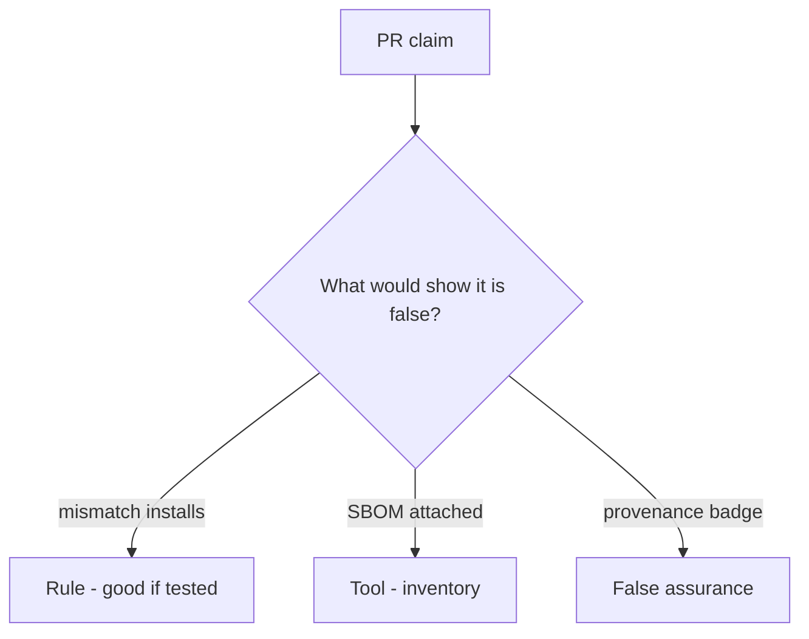

# Would you merge this always-true install_ok?

**Kind:** code-review
**Loop step:** Review

## What you are reviewing

Review `labs/10.2/10.2-lab/vulnerable/` as a change to the notes app’s CI install check. Check whether `install_ok("aaa", "bbb")` still returns true.

Start at `install_ok` and the two hash strings, not at a scanner color or an SBOM screenshot. You already ran `test_hash_mismatch_refuses_install` — that is the rule. A comment “will pin later” is not.

## Picture: install_ok true on hash mismatch

**install_ok true on hash mismatch**.

A digest mismatch still has to be denied. If the change never checks digest equality, that always-install leftover is still open. An SBOM screenshot without that check is still the same problem.

Unpinned Actions are a sibling grain. Secrets in fork pull requests are 5.3. Do not skip `test_hash_mismatch_refuses_install`. Do not claim the ship gate. Do not fetch a live package to prove the finding.

## Problems to find (name them yourself)

- install_ok true on hash mismatch
- Unpinned action
- Secrets in PR from forks
- SBOM generated but never used

Also reject: live registry attacks; installing without re-running `test_hash_mismatch_refuses_install`; keys in learner notes; claiming the ship gate.

## Common mix-ups

- Lockfile without verify is integrity
- Private npm is safe
- A provenance badge is the app’s hash check
- Generating an SBOM verifies installs
- Dependabot is `install_ok`
- The ship gate follows from a green audit job

## Practice

Write the review that would block this change. Name `test_hash_mismatch_refuses_install`.

## Use it somewhere new

Clinic change that “added CycloneDX and Dependabot” without a digest check is an incomplete review of the install gate. Name the independent falsehood that would still keep mismatch from installing.

## Can people still use it

A denied install must say *digest mismatch* in words. Do not hide the reason behind a red X.

## What this page is not doing

Do not merge by adding a comment “will pin later.” That comment is leftover without an owner. Do not typosquat a public registry to prove the finding.
