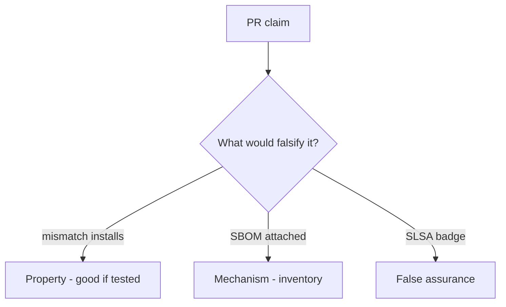

# 10.2-LO-08 — Review always-true install_ok as a PR

**Kind:** code-review
**Loop step:** Review
**Standards:** ASVS `v5.0.0-15.1.2`, `v5.0.0-13.3.1`. SLSA 1.2 as vocabulary. CISA 2026 SBOM as inventory.

## Review the fixture as if it were SecureCollab CI install

Review `labs/10.2/10.2-lab/vulnerable/` as a SecureCollab PR. Your job is not to count suspicious lines. Reconstruct whether `install_ok("aaa", "bbb")` still returns true, compare that with the module invariant, and write changes a developer can verify.

Intended findings live only in `content/assessment/keys/10.2.md` — not here. Do not open the keys file until your review has been evaluated.

## Mental model: install_ok True on hash mismatch

Start with this seeded smell: **install_ok True on hash mismatch**. Label it property, mechanism, or false assurance before you accept the PR.

Classification starts at the protected effect (mismatch denied). Everything that is not digest equality at that call is a candidate always-install path. An SBOM screenshot without that pytest is the same smell, not a different finding class.

Unpinned Actions are a sibling grain. Secrets in fork PRs are 5.3. Do not skip `test_hash_mismatch_refuses_install`. Do not claim Gate 10. Do not fetch a live package to prove the finding.

## Seeded smells (label them yourself)

- install_ok True on hash mismatch
- Unpinned action
- Secrets in PR from forks
- SBOM generated but never used

Also reject: live registry attacks; installing without re-running `test_hash_mismatch_refuses_install`; keys in lessons; claiming Gate 10 or M4.

## Misconceptions this module refuses

- Lockfile without verify is integrity
- Private npm is safe
- SLSA badge is the app’s 1.2
- Generating an SBOM verifies installs
- Dependabot is `install_ok`
- Gate 10 follows from a green audit job

## Practice

Write three review notes a maintainer could act on. Each note: observation, property or false assurance, suggested structural change, residual you will **not** delete. Tie at least one to `test_hash_mismatch_refuses_install`.

## Transfer

Clinic PR that “added CycloneDX and Dependabot” without a digest check is an incomplete install-gate review. Name the independent falsehood that would still keep mismatch from installing.

## Non-goals

Do not merge by adding a comment “will pin later.” That comment is a residual without an owner. Do not typosquat a public registry to prove the finding.
