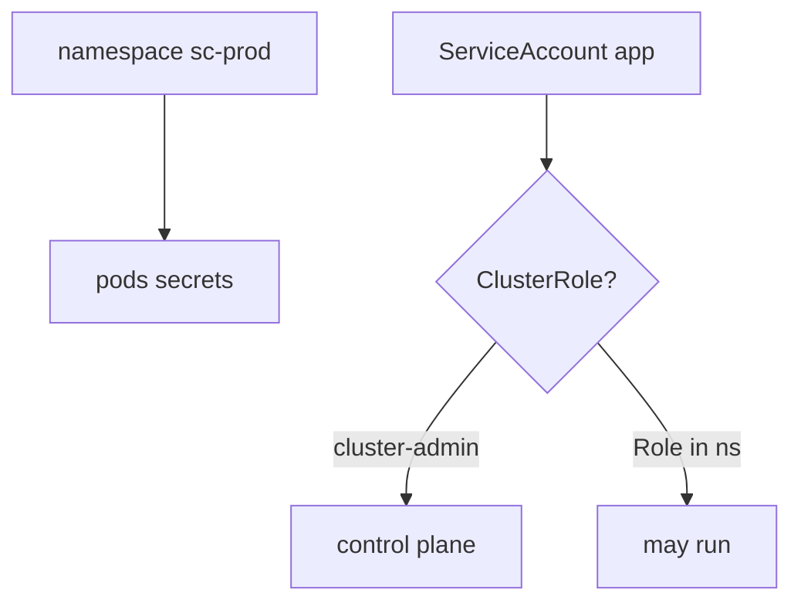
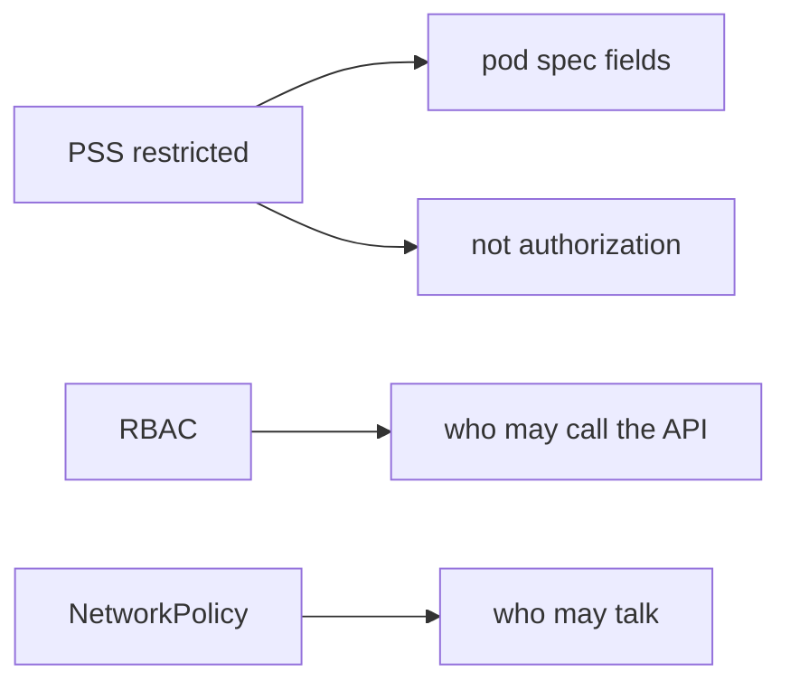

# 10.3-LO-01 — A namespace is not cluster-admin

**Kind:** concept-model
**Loop step:** 1 Property
**Standards:** NIST SP 800-190 (final, 2017) as container-stack vocabulary. Kubernetes PSS/PSA (stable) as pod-hardening vocabulary. ASVS `v5.0.0-13.2.1`, `v5.0.0-13.2.2`, `v5.0.0-13.2.4`; `v5.0.0-13.2.6` is **Level 3, advanced**.

## The claim this module owns

SecureCollab’s API pods run on a lab cluster (or a serverless analogue). **Authorization of the control plane** is whether the app ServiceAccount can mutate the cluster. A Kubernetes *namespace* is a name for objects. It is not a tenant and not least privilege.

> `pod_ok("cluster-admin")` must be false. `pod_ok("app")` may be true.

The forbidden outcome is **app pod granted cluster-admin**. That is 3.3 at cluster grain: one app bug becomes cluster takeover.

ASVS `v5.0.0-13.2.1` wants backend components authenticated with individual service accounts, not a shared god role. `v5.0.0-13.2.2` wants those accounts least-privileged. `v5.0.0-13.2.4` wants an outbound allowlist — the hop to instance metadata (6.5) is how node IAM leaks into the pod. `v5.0.0-13.2.6` (documented connection/retry toward the cluster API) is **Level 3, advanced**. NIST SP 800-190 names five layers (image, registry, orchestrator, container, host); it does not make EKS “secure by default.” Kubernetes PSS `restricted` hardens the *pod spec*; it does not replace RBAC.

## Mental model: namespace vs ClusterRole



## Mental model: PSS is not RBAC



**Mechanism (not the property):** EKS defaults, Helm, “we use Kubernetes,” NetworkPolicy, a CIS benchmark score.

## Root cause vs impact vs prevention vs detection vs recovery

| Slice | For this property |
|---|---|
| Root cause | God-mode for convenience |
| Preconditions | `pod_ok("cluster-admin")` true |
| Trigger | Compromised container or malicious chart |
| Impact | Authorization of the control plane |
| Prevention | Namespaced RoleBinding; PSS restricted; IMDS hop denied |
| Detection | `cluster_admin_denied` |
| Recovery | Rotate cluster credentials; revoke the binding |

## Framework defaults versus the cluster guarantee

A default ServiceAccount in a namespace often mounts a token. Managed Kubernetes still accepts a ClusterRoleBinding you apply. `Dockerfile USER root` and `hostNetwork` are extra grains, not this cell.

## Mechanism limits

- NetworkPolicy is not RBAC.
- PSS `restricted` with ClusterRole `cluster-admin` still takes the API.
- Node IAM via instance metadata (6.5).
- Helm charts that create ClusterRoles as a “convenience.”

## Usability and accessibility

Admission denial must say *cluster-admin refused* in text, not only a red webhook (WCAG 2.2 4.1.3).

## Practice

Name the ServiceAccount and the Role it is bound to. Then run:

```
python3 -m pytest labs/10.3/10.3-lab/tests --impl vulnerable
python3 -m pytest labs/10.3/10.3-lab/tests --impl fixed
```

The first command must fail. The second must pass.

## Transfer

Serverless IAM `*`. Clinic: app SA is cluster-admin.

## Non-goals

Live clusters, claiming Gate 10 or M4. Answer keys are not in this file.
