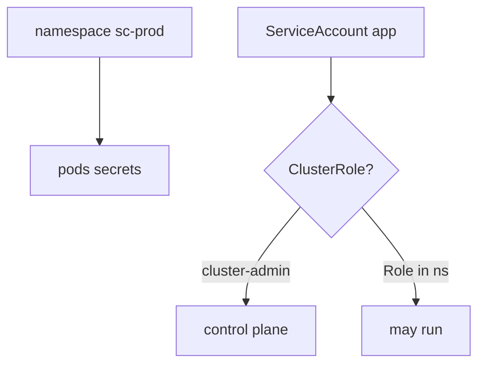
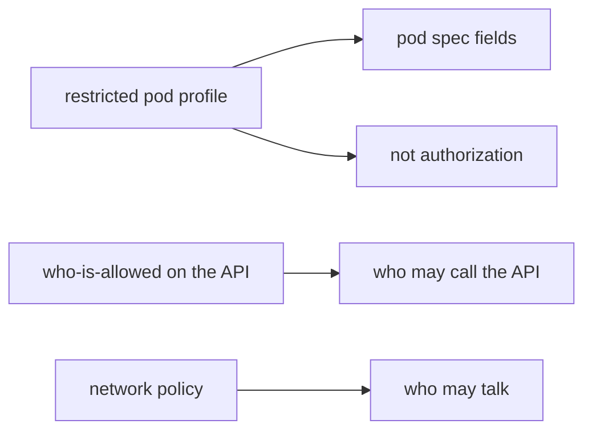

# A namespace is not cluster-admin

**Kind:** concept-model
**Loop step:** 1 Property

## The rule

The notes app's API pods run on a lab cluster (or a serverless analogue). **Authorization of the control plane** is whether the app ServiceAccount can change the cluster. A Kubernetes *namespace* is a name for objects. It is not a tenant and not least privilege.

> `pod_ok("cluster-admin")` must be false. `pod_ok("app")` may be true.

So what must not happen: **an app pod granted cluster-admin**. That is least privilege at cluster grain — the same idea as a shared database god-role: one app bug becomes cluster takeover.

Industry lists ask for backend pieces authenticated with their own service accounts, not a shared god role. They want those accounts least-privileged. They want an outbound allow-list — the hop to instance metadata is how node credentials leak into the pod. Documented connection and retry toward the cluster API is extra, advanced work, not this week's check. A container-stack guide names five layers (image, registry, orchestrator, container, host). It does not make a managed cluster "secure by default." A restricted pod profile hardens the *pod spec*. It does not replace who may call the API.

This week's practice is this course's local files. Do not tell anyone to try attacks on public or third-party clusters.

## Picture: namespace vs ClusterRole



## Picture: a restricted pod profile is not who-is-allowed



**A tool, not the rule:** managed-cluster defaults, Helm, "we use Kubernetes," a network policy, a CIS benchmark score.

## Why it happens, what it costs, how you stop it, how you notice, how you recover

Someone granted god-mode for convenience. That is the cause. Cluster takeover from one app bug is a **result**, not the cause.

| Slice | For this rule |
|---|---|
| Why it happens | God-mode for convenience |
| What has to be true first | `pod_ok("cluster-admin")` true |
| Trigger | Compromised container or malicious chart |
| What it costs | Authorization of the control plane |
| How you stop it | Namespaced RoleBinding; restricted pod profile; IMDS hop denied |
| How you notice | `cluster_admin_denied` |
| How you recover | Rotate cluster credentials; revoke the binding |

## What the framework does vs what you still have to check

A default ServiceAccount in a namespace often mounts a token. Managed Kubernetes still accepts a ClusterRoleBinding you apply. `Dockerfile USER root` and `hostNetwork` are extra grains, not this rule.

What this practice is supposed to show: `pod_ok("cluster-admin")` is false. The local check is `labs/10.3/10.3-lab`. Fake role strings only. No live clusters.

## What the tool cannot do

- A network policy is not who-is-allowed on the API.
- A restricted pod profile with ClusterRole `cluster-admin` still takes the API.
- Node credentials via instance metadata.
- Helm charts that create ClusterRoles as a "convenience."

## Can people still use it

Admission denial must say *cluster-admin refused* in text, not only a red webhook.

## Practice

Name the ServiceAccount and the Role it is bound to. Then run:

```text
python3 -m pytest labs/10.3/10.3-lab/tests --impl vulnerable
python3 -m pytest labs/10.3/10.3-lab/tests --impl fixed
```

The first command must fail. The second must pass.

## Use it somewhere new

Serverless IAM `*`. Clinic: app SA is cluster-admin.

## What this page is not doing

Live clusters, claiming you finished an assurance gate from this page. Answer keys are not on this site.
